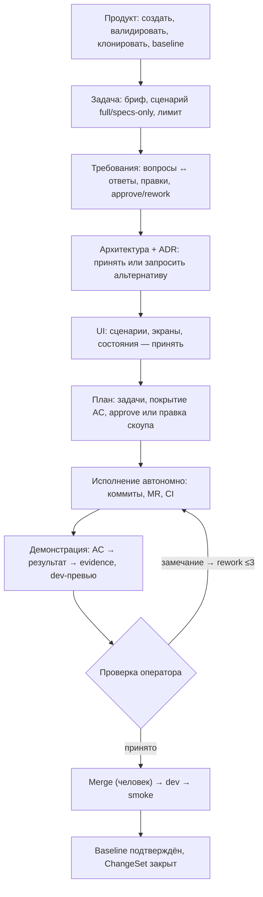
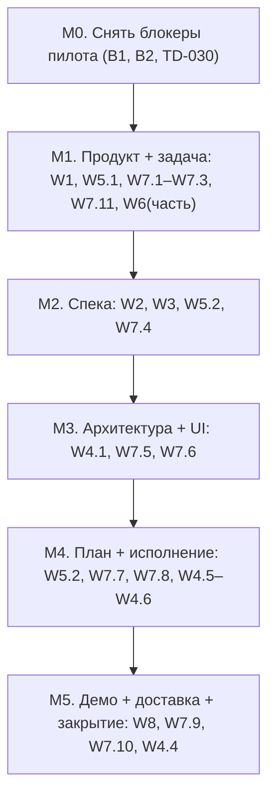

# План: рабочее пространство ChangeSet (MVP)

Операционный план доведения фабрики до состояния, в котором MVP принимается: оператор ведёт изменение от идеи до работающего приложения **из интерфейса** (Console или CLI), без низкоуровневых команд и ручных правок артефактов агента.

- Статус: принят оператором 2026-09-19; работы — `specs/001-dark-factory-mvp/tasks.md` T061–T066.
- Решения: [ADR-030](adr/ADR-030-product-registry.md)…[ADR-037](adr/ADR-037-console-changeset-workspace-ia.md).
- Основание: видение оператора (17 шагов, 8 фаз Ф0–Ф8), ответы оператора на 11 вопросов (2026-09-19), `docs/t043-pilot-journal.md`.
- Роли: `architect` (ADR, план), `develop` (код), `design` (UX), `quality` (проверка), `ci-cd` (ветка, MR).

---

## 1. Проблема

Фабричное ядро в основном написано (US1–US6, durable-раннер ADR-024/025), но **принять MVP нельзя**: оператор не может работать с продуктом из интерфейса.

| Симптом | Факт |
|---|---|
| Нельзя завести продукт | Сущности `Product` в домене нет — только `RepositoryRef{provider, slug}` внутри `Change` (`src/dark_factory/changes/refs.py`) |
| Фабрика не готовит репозиторий | Клона нет: воркспейсы минтятся из операторских локальных mirror (`DARK_FACTORY_WORKSPACE_MIRROR_ROOT`, `src/dark_factory/execution/workspace.py`) |
| Нет диалога по спеке | Домена «вопрос/ответ/комментарий» нет; агент умеет только остановиться через `blocked` |
| Нет просмотра/правки артефактов | Артефакт — `ArtifactRef(uri)` в git/CI; поверхности чтения/редактирования нет |
| Непонятно, что делать дальше | Нет проекции «следующий шаг»; CLI — низкоуровневый (`run advance`, `--contract-json`) |
| Консоль — наблюдатель, не рабочий инструмент | 6 экранов: список, карточка, гейты, бюджеты, CI-переключатели, настройки (`console/README.md`) |

**Подтверждение:** весь журнал T043 — это ручная работа оператора там, где должна работать консоль (`pilot_api.py approve`, ручной merge спек-CR `product-1#1–#9`, ручной merge-forward, `advance-contract --contract-json`). Блокеры пилота B1/B2, TD-030, TD-031 — следствия отсутствующего продуктового слоя.

**Цель MVP:** на чистом репозитории калькулятора пройти `продукт → требования → архитектура → UI → план → исполнение → демонстрация → доставка` из Console/CLI, где **на каждом шаге виден ровно один следующий шаг**.

---

## 2. Зафиксированные решения

| # | Решение оператора | Следствие |
|---|---|---|
| 1 | Клон репозитория разрешён, токен — в секретах | `RepositoryProvisioningPort.clone` на GitHub App installation-токене; отдельный PAT — только если репо вне установки App ([ADR-031](adr/ADR-031-repository-provisioning.md)) |
| 2 | Приёмка — полный сценарий | `intent → deploy: dev → smoke`; модель промоушена (TD-031) обязательна в объёме (M5) |
| 3 | Новый чистый репозиторий | Провижининг обязан уметь пустой репо (unborn HEAD) → bootstrap baseline из `packs/` |
| 4 | Phase-проекция — согласна, если не ломает логику | `Stage` и таблицы переходов не меняются; добавляется проекция фаз ([ADR-032](adr/ADR-032-phase-projection.md)) |
| 5 | Галереи экранов + ссылки на dev-URL | UI-фаза: галерея, состояния, ссылка; интерактивный canvas — вне объёма |
| 6 | Git — источник истины для артефактов | Ревизии в git (`.factory/changes/...`), черновик автосейва вне git ([ADR-035](adr/ADR-035-document-artifacts-git-source-of-truth.md)) |
| 7 | Approve в консоли + помощь в мерже | Решение фиксируется в консоли; merge — по-прежнему человек, но через «Помощник merge» ([ADR-036](adr/ADR-036-merge-assistant.md)) |
| 8 | API — контракт, затем CLI, затем Console | Порядок реализации; оба интерфейса — над одним API |
| 9 | Один оператор | Без multi-user; комментарии от оператора; bearer-токен как сейчас |
| 10 | Жёсткий лимит расхода | Лимит в intake; hard-stop ChangeSet на лимите |
| 11 | Отложить второстепенное | Activity feed, WorkGraph, детект пересечений, Plane-sync, 4-й режим редактора, axe/visual regression, canvas, agent-diff-apply, multi-user — вне объёма |

---

## 3. Phase-проекция

Восемь пользовательских фаз ложатся на существующие пять стадий `Flow`; модель переходов, идемпотентность, гейты и merge policy **не меняются**.

| Фаза | Стадия ядра | Control point / гейт | Артефакт фазы |
|---|---|---|---|
| Ф0 Инициатива | до запуска (intake) | — | структурированный бриф |
| Ф1 Требования | `specification` | `problem` / `specification` | дельта требований + вопросы |
| Ф2 Архитектура | `specification` (проектирование) | `solution` (ADR-029) | ADR + design |
| Ф3 Интерфейс | `specification` | `ux` / `ui` (ADR-029) | UI-спеки, галерея экранов |
| Ф4 План | `planning` | `solution` / `planning` | Implementation Contract + задачи |
| Ф5 Исполнение | `construction` | автономно | код, коммиты, MR, CI |
| Ф6/Ф7 Демонстрация | `review_verification` | `discovery_release` / `review` | AC → результат → evidence |
| Ф8 Доставка | `release` | `release` + reconciliation | dev, smoke, дельта baseline |

Следствие для UX: фазы Ф2 и Ф3 живут внутри одной стадии `specification`, поэтому «следующий шаг» обязан вести **по фазам** — это задача `Guidance` ([ADR-033](adr/ADR-033-operator-guidance.md)).

---

## 4. Принцип «следующий шаг» (Guidance)

Ключевое требование оператора: **пользователь никогда не остаётся без следующего шага**. Это контракт продукта, а не деталь вёрстки.

`Guidance` — детерминированная серверная проекция состояния ChangeSet: считается в ядре, отдаётся API, рендерится CLI и Console без дублирования логики ([ADR-033](adr/ADR-033-operator-guidance.md)).

| Поле | Пример (фаза «Требования») |
|---|---|
| `headline` | Требования готовы к согласованию |
| `why` | Агент обработал 4 замечания, 3 вопроса закрыты |
| `primary` | **Согласовать требования** |
| `secondary` | На доработку · Посмотреть дельту |
| `blockers` | Блокирующих вопросов: 2 → [Ответить] · Лимит: 18% |
| `after` | После согласования: архитектура и ADR (≈4 мин) |

Правила:

1. Ровно одно primary-действие; подпись этапная («Согласовать архитектуру», «Утвердить план и запустить»), не общий Approve.
2. Каждый экран отвечает: что готово · что изменилось · что мешает · какое решение нужно.
3. Тупиков нет: недоступное действие объясняет причину и даёт действие по её снятию.
4. После каждого действия — «Что дальше».
5. CLI печатает тот же блок: `factory change status` и после каждой команды.
6. Блокер описывается как `{что, кто снимает, как}`.

---

## 5. Помощник merge

ADR-011 не меняется: **решение о merge принимает человек**. Меняется исполнение — оно становится юзабельным ([ADR-036](adr/ADR-036-merge-assistant.md)).

- Чек-лист готовности: CI required ✅ · approving review на head SHA ✅/❌ · branch protection ✅/❌ · согласования фаз ✅.
- Каждый ❌ — человекочитаемо и с действием: «Нужен approving review на `f61f247a` → [Открыть PR] / [Запросить review]».
- «Смержить» — одна явная кнопка с подтверждением: `MergeRequestPort.merge(expected_sha)`, решение записывается как человеческое. Автомержей нет.
- После merge консоль видит наблюдаемый merge и показывает «Что дальше».
- Недоступная кнопка объясняет причину.

---

## 6. Целевой сквозной сценарий и DoD приёмки

**DoD приёмки MVP:** на новом чистом репозитории калькулятора сквозной прогон `intent → deploy` — без ручных правок артефактов агента и без низкоуровневых CLI-команд; каждое согласование версионно привязано; после правки прежнее согласование/evidence не «зелёное»; на любом шаге CLI и Console показывают один и тот же следующий шаг; лимит расхода соблюдён с доказанным hard-stop.

---

## 7. Workstreams

Оценки: S ≈ ½–1 день, M ≈ 2–4 дня, L ≈ неделя+.

| W | Содержание | Ключевые задачи | ADR |
|---|---|---|---|
| **W1** Продукт и репозиторий | `Product`, статусы валидации, провижининг (validate/clone/bootstrap), миграции | T062 | 030, 031 |
| **W2** Обсуждения и правки | `Question`/`Answer`, `Comment` с якорем, `ReworkOrder`, лимит 3, «просмотрено» ≠ «согласовано» | T063 | 034 |
| **W3** Документы-артефакты | read-model дерева, ревизии/diff, frontmatter-свойства, write-through в git, черновики, staleness | T063 | 035 |
| **W4** Движок: фазы, гейты, guidance, merge, управление | `Phase`-проекция, прекондиции гейтов, `Guidance`, помощник merge, pause/resume/cancel/correct, hard-stop бюджета | T062–T065 | 032, 033, 036 |
| **W5** API | `/products`, ChangeSet-ресурсы, `/attention`, `/activity`, merge-assist, обновление `docs/descriptions/api.md` | T062–T066 | 033 |
| **W6** CLI | `product add/validate`, `change create/status/answer/approve/rework/run/artifacts/merge`, интерактивный Q&A | T062–T066 | 033 |
| **W7** Console | IA (Продукты · Требует внимания · Активность), экран ChangeSet, компонент «Следующий шаг», intake, требования, архитектура, UI, план, исполнение, демонстрация, доставка, markdown-редактор | T062–T066 | 037 |
| **W8** Доставка и проверка | Модель промоушена (TD-031), превью + smoke, снятие блокеров пилота (B1/B2, TD-030), e2e-прогон калькулятора | T065, T066 | — |
| **W9** Документы | ADR-030…037, HLD, техдолг, трекер | T061 | — |

Детальная декомпозиция каждой задачи — при её старте (Native SDD Core, ADR-020); здесь фиксируются объём и DoD.

---

## 8. Milestones

| Milestone | Что оператор может | UX-критерий | Задача |
|---|---|---|---|
| **M0** | — (гейты пилота перестают клинить) | — | вне T061–T066 (B1/B2/TD-030) |
| **M1** | Создать продукт, увидеть «репо валиден», создать задачу с выбором сценария | На каждом экране один CTA и «что дальше» | T062 |
| **M2** | Пройти Q&A, править md, согласовать или отправить на доработку | Вопрос отвечается в один клик; после действия — сводка | T063 |
| **M3** | Принять/отклонить архитектуру и UI | «Запросить альтернативу» без ухода с экрана | T064 |
| **M4** | Утвердить план и запустить, наблюдать, вмешаться | Видно, что и почему мешает; лимит честный | T065 |
| **M5** | Получить dev-превью, дать замечание, rework, принять, смёржить из консоли, закрыть | Merge-помощник объясняет каждый блокер; baseline подтверждается явно | T066 |

Порядок: **M1 первым** (решение оператора) — он снимает главный блокер «не могу завести продукт и задачу из интерфейса».

---

## 9. Трассировка

| Что | Где |
|---|---|
| ADR | [ADR-030](adr/ADR-030-product-registry.md), [ADR-031](adr/ADR-031-repository-provisioning.md), [ADR-032](adr/ADR-032-phase-projection.md), [ADR-033](adr/ADR-033-operator-guidance.md), [ADR-034](adr/ADR-034-conversations-and-rework-orders.md), [ADR-035](adr/ADR-035-document-artifacts-git-source-of-truth.md), [ADR-036](adr/ADR-036-merge-assistant.md), [ADR-037](adr/ADR-037-console-changeset-workspace-ia.md) |
| Задачи | `specs/001-dark-factory-mvp/tasks.md` T061–T066 |
| Техдолг | TD-030 (снятие рана), TD-031 (модель промоушена) — `docs/tech-dept.md` |
| Архитектура | `docs/hld.md` (обновляется при реализации каждой вехи) |
| Контракт API | `docs/descriptions/api.md` (обновляется в W5) |

---

## 10. Риски и открытые вопросы

| Риск | Митигация |
|---|---|
| Токен для клона репо вне установки GitHub App | Отдельный секрет и имя ключа в `.env.example`; решение — при старте M1 |
| Модель промоушена (TD-031) не описывает multi-image продукт | Отдельный ADR в M5 до реализации; до него живой `release` не заявлять |
| Дорогая консоль (много экранов) | Порядок API → CLI → Console; сначала сквозная ценность, затем удобство |
| Дрейф логики между CLI и Console | Единый серверный `Guidance`; UI и CLI только рендерят |
| «Зелёный» Synced без фактического деплоя (TD-025) | Превью/smoke проверяются по факту, а не по статусу Argo |

---

## 11. Вне объёма

Activity feed (кроме inbox), WorkGraph-граф, детект пересечений ChangeSet, Plane-sync-статус, 4-й режим «Сравнение» в редакторе, axe/visual regression (показывать «запланировано на исполнении»), интерактивный UI-canvas (ссылка/iframe на dev), agent-diff-apply в редакторе (сначала поручение + rework), multi-user auth.

---

## 12. Связанные документы

- `AGENTS.md` — роли, конвейер, DoD, git-цикл.
- `docs/hld.md` — текущая архитектура.
- `docs/sdd-native-core.md` — каноническая модель SDD (ADR-020).
- `docs/t043-pilot-journal.md`, `docs/plan-t043-closure.md` — живой ход пилота и его блокеры.
- `docs/adr/ADR-018-human-participation-autonomous-execution.md`, `docs/adr/ADR-023-risk-classes-and-control-points.md`, `docs/adr/ADR-029-human-gates-at-design-phase.md` — фазы и точки контроля.
- `docs/adr/ADR-011-risk-based-merge-release-policy.md` — merge/release (уточняется ADR-036).
