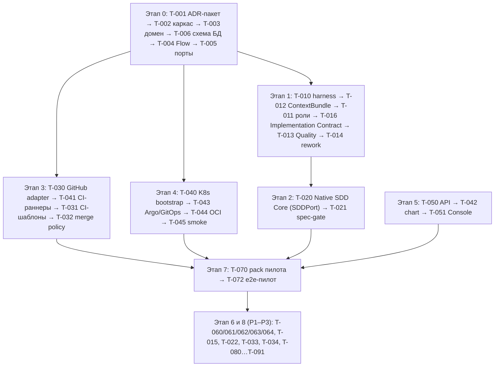

# План работ — Software Dark Factory MVP v1

**На основе:** `docs/vision-2026-09-13-v1.md`
**Дата:** 2026-09-13
**Статус:** 🟡 В работе
**Контекст:** репозиторий pre-MVP, greenfield (`src/` пуст). Все задачи стартуют со статусом 🔴. Слой/модуль — по модульному монолиту из HLD (`docs/hld.md`; Changes, Orchestration, Agents, Context, Execution, Quality + ports/adapters, api, cli, console, packs).

**Принятые решения (данность, не пересматриваются здесь):** SDD-модель — Native SDD Core (ADR-020, полная спецификация — `docs/sdd-native-core.md`): ChangeSet + Product Baseline `.factory/`, дельты и reconciliation; Spec Kit (ADR-001, workflow `/speckit-*`) — инструмент bootstrap-фазы до готовности Native Core (T-020); OpenSpec (ADR-017, заменён ADR-020) — compatibility-инструмент. Конституция `.specify/memory/constitution.md` v3.0.0 (SDD обязателен для фич, каноническая модель — Native SDD Core, evidence-based validation, минимальные изменения, ADR-governance). Модель участия человека по фазам и границы автономной реализации — ADR-018 (реализация — T-016). Состав инфраструктуры MVP при конфликте определяет ADR-009 (минимальный bootstrap + OTel). SC/CI-провайдеры — через адаптеры за портами `SourceControlPort`/`CIPort`: MVP стартует на GitHub-адаптере, GitLab-адаптер — второй провайдер (ADR-019).

**Правки 2026-09-14 (ADR-020, Native SDD Core):** T-020 переформулирована (Native SDD Core: `SDDPort` + `NativeChangeSetAdapter`, Product Baseline `.factory/`, ChangeSet и reconciliation — вместо перехода на OpenSpec), T-021 дополнена фиксацией GateDecision, T-022 — шаблоны Product Baseline/ChangeSet для продуктовых репо; Q-16 закрыт ADR-020 (ADR-017 заменён); ordering-диаграмма обновлена.

**Правки 2026-09-13 (валидация ADR-001…018):** синхронизированы T-001 (PostgreSQL как state store, ADR-004), T-006 (durable effect ledger, ADR-006 п.3), T-022 (OpenSpec вместо `/speckit-constitution`, ADR-017), T-033 (Plane, ADR-013), T-040 (restore-тест, capacity smoke, проверка GitLab-лицензии — ADR-004/010/012), T-050 (AuthN-условия ADR-009 п.7), T-061/T-072 (P0-минимум evidence-индекса); ordering-диаграмма переименована (T-020 — OpenSpec-миграция).

**Правки 2026-09-13 (ADR-019, GitHub-first SC/CI):** Этап 3 переименован в «SC/CI-контур (GitHub → GitLab)»: T-030 — GitHub-адаптер (GitHub App с короткоживущими installation tokens, webhooks, Actions, Checks API, artifacts, merge policy), GitLab-адаптер перенесён в T-034 (P1) на единой контрактной тест-сюите; MR/PR сведены к `ChangeRequestRef`; провайдер выбирается на уровне репозитория; один run исполняется ровно в одном провайдере. Синхронизированы T-002, T-005, T-011, T-031, T-032, T-040, T-041, T-064, T-090; Q-11 привязан к T-034.

---

## 1. Задачи (Tasks)

### Этап 0 — Решения и каркас

### T-001. ADR-пакет по открытым архитектурным вопросам

- **Родительская функция:** все (3.1–3.15)
- **Приоритет:** P0
- **Сложность:** M
- **Слой:** docs
- **Пакет / Компонент:** `docs/adr/`
- **Описание:** Провести и зафиксировать ADR по разделу 5 настоящего плана. Минимально необходимый набор для старта P0: (1) язык/стек Core, (2) Temporal — исключение из MVP, (3) PostgreSQL как authoritative operational state store ядра (ADR-004), (4) deployment-цель (локальный K8s), (5) merge policy MVP, (6) трекер пилота, (7) UI pack пилота, (8) структура репозиториев. Остальные вопросы — до соответствующих этапов.
- **Критерий готовности (DoD):** ADR-002…ADR-00N приняты и согласованы с vision; ни один конфликт раздела 5 не остаётся без решения перед стартом зависимой задачи.
- **Зависит от задач:** —
- **Статус:** ✅ Принято (ADR-002…ADR-017, 2026-09-13)

### T-002. Scaffolding репозитория и базовый CI

- **Родительская функция:** 3.1
- **Приоритет:** P0
- **Сложность:** XS
- **Слой:** все
- **Пакет / Компонент:** `src/`, `tests/`, CI-конфиг провайдера репозитория (`.github/workflows` | `.gitlab-ci.yml`)
- **Описание:** Структура пакетов по модулям HLD (changes, orchestration, agents, context, execution, quality, ports, adapters), pyproject/venv, ruff/mypy/pytest, простейший pipeline (lint+test) на CI-провайдере репозитория (MVP — GitHub Actions, ADR-019).
- **Критерий готовности (DoD):** typecheck + lint + test зелёные локально и в CI.
- **Зависит от задач:** T-001 (стек)
- **Статус:** ✅ Выполнено (2026-09-13): пакет `dark_factory` (src-layout, 8 модулей HLD), uv + ruff/mypy strict/pytest, тест границ импортов (ADR-015 п.3), GitHub Actions lint+typecheck+test; локальный прогон зелёный, CI подтвердится при push/PR

### T-003. Доменная модель изменения

- **Родительская функция:** 3.1
- **Приоритет:** P0
- **Сложность:** M
- **Слой:** Factory Core
- **Пакет / Компонент:** `changes`
- **Описание:** Pydantic-модели: Change, ChangeRun, StageRun, StageResult, NextAction, ArtifactRef, Evidence, Decision, Finding, GateResult, Usage, BudgetSnapshot; сериализация в run records (JSON/YAML) для сохранения между CI jobs.
- **Критерий готовности (DoD):** typecheck + lint + test (round-trip сериализация, инварианты переходов статусов).
- **Зависит от задач:** T-002
- **Статус:** ✅ Выполнено (2026-09-13): модуль `dark_factory.changes` — Pydantic v2 контракты (Change, ChangeRun, StageRun, immutable StageResult, NextAction — закрытое дискриминированное объединение из 8 вариантов, ArtifactRef, Evidence, ChangeRequestRef/RepositoryRef по ADR-019, Decision, Finding, GateResult, Usage, BudgetSnapshot, RunManifest/RunRecord со schema_version), ключи идемпотентности ADR-006 п.3, детерминированные таблицы переходов статусов run/stage с единой валидацией (`apply_status`), инварианты завершения ADR-009 п.9, сериализация run records JSON/YAML (round-trip); добавлены зависимости pydantic + pyyaml и плагин mypy; ruff + mypy strict + pytest (45 тестов) — зелёные локально, CI повторяет те же команды

### T-004. Factory Flow: стадии, переходы, гейты, маршруты

- **Родительская функция:** 3.1
- **Приоритет:** P0
- **Сложность:** L
- **Слой:** Factory Core
- **Пакет / Компонент:** `orchestration`
- **Описание:** Детерминированный Flow: стадии по AI-DLC-подобным фазам (Specification → Planning → Construction → Review/Verification → Release), 7 гейтов MVP, маршруты quick/standard, TaskGraph (pydantic-graph) только внутри стадии; продолжение между job'ами через StageResult/NextAction; лимиты rework/бюджета на уровне Flow; стоп-условия → Blocked.
- **Критерий готовности (DoD):** typecheck + lint + test: таблица переходов покрыта тестами целиком; `NextAction` — закрытое объединение, обработчики проходят exhaustiveness-проверку mypy (`assert_never`); переход вне таблицы невозможен в рантайме (единая точка перехода + тест); мёртвых рёбер нет; лимиты срабатывают детерминированно.
- **Зависит от задач:** T-003, T-006
- **Статус:** ✅ Выполнено (2026-09-13): детерминированный межстадийный Flow в `orchestration/flow.py` — иммутабельная таблица `FLOW_TRANSITIONS` (стадия × NextAction, ADR-005 п.2), единая точка перехода `apply_result` (вне таблицы — `InvalidFlowTransition`), обработчики NextAction exhaustively с `assert_never` (mypy strict), продолжение между job'ами через `StageResult`/`NextAction` (ADR-006 п.2); маршруты quick/standard — `flows/routes.py` (`RouteProfile`, обе стадии проходят все 5 фаз, различие — политика гейтов); 7 гейтов MVP — `rules/gates.py` (обязательные по стадии/маршруту, SKIPPED удовлетворяет, «последний результат по гейту выигрывает»); лимиты rework/бюджета/дедлайна — `rules/limits.py` (детерминированные, `now` — явный параметр); стоп-условия и нарушения лимитов/гейтов → `Blocked` (FR-008, ADR-018 п.5); учёт usage в бюджет run (FR-016), защита от устаревших результатов по attempt (ADR-006 п.4), инварианты завершения на release (ADR-009 п.9). DoD: полный обход 40 пар (стадия × действие), тест мёртвых рёбер, детерминированные лимиты; pydantic-graph не вводился (внутристадийное исполнение — T-015). ruff + mypy strict + pytest — зелёные (143 passed + 13 skipped без БД)

### T-005. Порты и фейковые адаптеры

- **Родительская функция:** 3.1, 3.5
- **Приоритет:** P0
- **Сложность:** M
- **Слой:** ports/adapters
- **Пакет / Компонент:** `ports`, `adapters`
- **Описание:** Протоколы (`Protocol`) и in-memory-фейки для тестов.
  *Порты внешних систем:* `SourceControlPort`, разделённый на `RepositoryPort` / `MergeRequestPort` / `PipelinePort` (принцип dmtools-референса; доменный тип change request — единый `ChangeRequestRef` для GitHub PR / GitLab MR, ADR-019), `TrackerPort`, `HarnessPort`, `ArtifactStorePort`, `TelemetryPort`.
  *Внутренние порты ядра, введённые ADR:* `WorkflowEnginePort` — `start` / `resume` / `cancel` / `get_status` с `idempotency_key` и `expected_revision` (ADR-006 п.9); `ReconciliationService` — отдельный сервис, а не метод движка (ADR-006 п.9); `EventPublisherPort` — производители не зависят от схемы таблиц outbox (ADR-016 п.7).
  Остальные порты вводятся там, где впервые нужны, а не авансом: `KnowledgePort` и `ExecutionPort` — T-012, `CIPort` — T-030, `SDDPort` (`OpenSpecAdapter` / `SpecKitAdapter`) — T-020. В P0 все реализации — фейки; реальные адаптеры: T-010 (harness), T-030 (GitHub), T-033 (tracker), T-060 (OTLP); T-034 (GitLab) — P1.
- **Критерий готовности (DoD):** typecheck + lint + test: contract-тесты каждого порта на фейках; ни один модуль ядра не импортирует внешний SDK — проверка границ импортов в CI (ADR-015 п.3).
- **Зависит от задач:** T-002
- **Статус:** ✅ Выполнено (2026-09-13): слой портов `src/dark_factory/ports/` — 10 контрактов `@runtime_checkable` Protocol, сигнатуры 1:1 по `specs/001-dark-factory-mvp/contracts/ports.md`: `RepositoryPort`/`MergeRequestPort`/`PipelinePort` (единый `ChangeRequestRef`, ADR-019), `TrackerPort`, `HarnessPort`, `ArtifactStorePort`, `TelemetryPort`, `WorkflowEnginePort` и отдельный `ReconciliationService` (ADR-006 п.9: desired из PostgreSQL vs observed от движка, решение в пользу PostgreSQL после сверки), `EventPublisherPort`; DTO: `HealthStatus`/`PipelineStatus` (frozen dataclass), `OpenChangeRequest` (с `change_id` для дедупликации), `ArtifactSpec`, минимальные versioned `TaskEnvelope`/`AgentResult` (`schema_version=1`, расширяются в T-011), `ReconcileDesired`/`ReconcileObserved`/`ReconcileResult`, `DomainEvent` строго по envelope contracts/events.md, минимальный `Span` (ContextManager); `ports/__init__.py` — единая публичная поверхность: реэкспорт портов и доменных типов `changes` (адаптеры импортируют только `dark_factory.ports`, ADR-015 п.3). In-memory фейки `src/dark_factory/adapters/fakes/` (Fake*, чистая память): все keyed mutating-операции идемпотентны (повтор → тот же внешний эффект без дубликата: ensure_branch → та же ревизия, open → тот же CR, put → тот же ArtifactRef — content-addressed, publish дедуплицирует по `eventId`), `merge` проверяет `expected_sha` (`HeadMismatchError`), `find_existing` — по (repository, change_id). Контрактная сюита `tests/contract/` — по модулю на порт, фикстуры conftest отдают адаптер через тип порта (переносима на GitHub/GitLab без переписывания, ADR-019 §6); в `tests/test_import_boundaries.py` добавлено правило: ядро не импортирует SDK внешних систем (явный denylist, ADR-015 п.3). `ruff check` + `ruff format --check` + `mypy` + `pytest` — зелёные

### T-006. Схема состояния PostgreSQL и миграции

- **Родительская функция:** 3.1, 3.10
- **Приоритет:** P0
- **Сложность:** S
- **Слой:** Factory Core
- **Пакет / Компонент:** `changes`, `orchestration`, `deploy/migrations`
- **Описание:** Схема операционного состояния фабрики (ADR-004) и миграции (Alembic): `execution`, `stage`, `attempt` со `state_revision`; `execution_leases` (`resource_type`, `resource_id`, `owner_id`, `fencing_token`, `acquired_at`, `expires_at`, `heartbeat_at`) — ADR-006 п.6; `outbox` с версионированным envelope (`eventId`, `eventType`, `eventVersion`, `occurredAt`, `changeId`, `runId`, `stage`, `aggregateId`, `aggregateVersion`, `correlationId`, `causationId`, `artifactRefs`, `payload`) и `event_delivery` (`event_id`, `consumer_id`, `status`, `attempts`, `next_attempt_at`, `last_error`) — ADR-016 пп.3/5; ключи идемпотентности `operation_key` / `attempt_id` / `effect_key` (ADR-006 п.3) и durable effect ledger: `effect_key` уникален; статусы `planned/in_progress/succeeded/unknown`; `external_ref`; при `unknown` — lookup по детерминированному маркеру до повтора (ADR-006 п.3, ревизия 3).
- **Критерий готовности (DoD):** миграции применяются на чистой БД и откатываются; инварианты покрыты тестами — уникальность `operation_key`, уникальность `effect_key`, монотонность `fencing_token`, уникальность пары (`event_id`, `consumer_id`), атомарность «изменение состояния + запись в outbox» в одной транзакции; crash-тесты effect ledger: crash-before-call и crash-after-call-before-commit не создают второй идентичный внешний эффект.
- **Зависит от задач:** T-002, T-003
- **Статус:** ✅ Выполнено (2026-09-13): Alembic-миграция `0001_state_schema` (`migrations/`, обратима) и SQLAlchemy-модели/репозитории в `src/dark_factory/orchestration/state/` — `execution`/`stage`/`attempt` со `state_revision`, `execution_leases` с монотонным `fencing_token`, `outbox`/`event_delivery`, durable effect ledger (`planned/in_progress/succeeded/unknown`) и usage-агрегаты; инварианты и crash-тесты в `tests/integration/` (13 тестов на PostgreSQL 16); в CI добавлен postgres-сервис. `ruff` + `mypy --strict` + `pytest` — зелёные (58 passed с БД; 45 passed + 13 skipped без БД)

### Этап 1 — Агенты

### T-010. HarnessPort + PydanticAI-адаптер

- **Родительская функция:** 3.3
- **Приоритет:** P0
- **Сложность:** M
- **Слой:** Agents
- **Пакет / Компонент:** `adapters/harness_pydantic`
- **Описание:** Исполнение агентного задания: model/tools/structured output через PydanticAI; учёт usage (токены, стоимость); ограничения инструментов по профилю; LLM endpoint через существующий LiteLLM.
- **Критерий готовности (DoD):** typecheck + lint + test; функциональный прогон тестового задания на типизированный StageResult.
- **Зависит от задач:** T-005
- **Статус:** 🔴 Запланировано

### T-011. Профили ядра: Product, Develop, Quality + минимальные skills

- **Родительская функция:** 3.3
- **Приоритет:** P0
- **Сложность:** L
- **Слой:** Agents
- **Пакет / Компонент:** `agents/profiles`, `skills`
- **Описание:** Версионированные манифесты профилей (входы/выходы, tools, ограничения, stop-conditions); skills первого slice: intake, requirements-refinement, spec-авторинг, implementation, implementation-rework, code-review, acceptance-verification, change-request. TaskEnvelope/AgentResult по контрактам T-003.
- **Критерий готовности (DoD):** typecheck + lint + test; сквозной smoke «короткая задача → спека → код → review» на тестовом репозитории.
- **Зависит от задач:** T-010, T-012
- **Статус:** 🔴 Запланировано

### T-012. ContextBundle: сбор и фиксация контекста

- **Родительская функция:** 3.3, 3.10
- **Приоритет:** P0
- **Сложность:** M
- **Слой:** Context
- **Пакет / Компонент:** `context`
- **Описание:** Сбор источников (repo, `openspec/` — до T-020 `specs/`, конституция, ADR, engineering pack) с provenance, revision/hash; версионирование набора на запуск; формирование изолированного worktree. Вводит `KnowledgePort` (источники контекста → ContextBundle с версиями и provenance) и `ExecutionPort` (workspace/worktree, команды, сбор evidence) — контракты по образцу T-005.
- **Критерий готовности (DoD):** typecheck + lint + test; bundle воспроизводим (одинаковый hash на одинаковых входах); contract-тесты `KnowledgePort` и `ExecutionPort` на фейках.
- **Зависит от задач:** T-005
- **Статус:** 🔴 Запланировано

### T-013. Независимая приёмка (Quality)

- **Родительская функция:** 3.4
- **Приоритет:** P0
- **Сложность:** M
- **Слой:** Quality
- **Пакет / Компонент:** `quality`
- **Описание:** Контекст Quality строится заново из закреплённой спецификации, актуального diff и evidence (не наследует контекст Develop); контракт Finding (severity, category, evidence, confidence); GateResult pass/fail/blocked для конкретного SHA; разделение blocking/non-blocking.
- **Критерий готовности (DoD):** typecheck + lint + test; review тестового MR с findings обоих классов; блокирующий finding реально останавливает merge.
- **Зависит от задач:** T-011
- **Статус:** 🔴 Запланировано

### T-014. Bounded rework loop

- **Родительская функция:** 3.4
- **Приоритет:** P0
- **Сложность:** M
- **Слой:** Orchestration
- **Пакет / Компонент:** `orchestration`
- **Описание:** Цикл review → rework → re-review с лимитом 3; новый Attempt не переписывает прежнее состояние; новый SHA аннулирует предыдущий допуск; исчерпание лимитов/повторяющиеся ошибки/конфликт требований → Blocked с диагностикой человеку. Условия остановки — подмножество правил эскалации [ADR-018](adr/ADR-018-human-participation-autonomous-execution.md) п.5, полный набор реализуется в T-016.
- **Критерий готовности (DoD):** typecheck + lint + test: лимиты и эскалации покрыты тестами.
- **Зависит от задач:** T-013, T-004
- **Статус:** 🔴 Запланировано

### T-015. TaskGraph внутри стадии: параллельные подзадачи

- **Родительская функция:** 3.1, 3.3
- **Приоритет:** P1
- **Сложность:** M
- **Слой:** Orchestration
- **Пакет / Компонент:** `orchestration`
- **Описание:** pydantic-graph: branch/join для ≤2 независимых подзадач внутри одного job; агрегация результатов через reducers; конкурентная запись в state — через типизированные outputs.
- **Критерий готовности (DoD):** typecheck + lint + test: параллельное выполнение детерминированно, join не теряет результаты.
- **Зависит от задач:** T-004
- **Статус:** 🔴 Запланировано

### T-016. Implementation Contract и границы автономной реализации

- **Родительская функция:** 3.1, 3.8
- **Приоритет:** P0
- **Сложность:** M
- **Слой:** Orchestration/Policy
- **Пакет / Компонент:** `orchestration/policy`, `agents/profiles`
- **Описание:** Реализация [ADR-018](adr/ADR-018-human-participation-autonomous-execution.md): (1) схема **Implementation Contract** — scope, acceptance criteria, архитектурные ограничения, UI evidence, риск-класс, бюджет (итерации/время/стоимость), правила эскалации; типизированная модель в контрактах T-003, место хранения в MVP — задача/MR, после T-020 — артефакт ChangeSet (ADR-020). (2) **Классификатор Known / Bounded choice / New path**: known — решение закреплено ADR/шаблоном/golden path, агент применяет сам; bounded — выбор из разрешённых вариантов с фиксацией rationale; new — новая технология, граница сервиса, хранилище, протокол или IAM-модель → обязателен человек и ADR. (3) **Машинно проверяемые условия эскалации** (ADR-018 п.5): противоречивые/недостаточные требования, выход за утверждённый scope, изменение публичного API / схемы данных / IAM / архитектурной границы, предложение нового ADR, непройденные security/quality gates, превышение бюджета автономных итераций, неподтверждаемый автоматически UI, необратимая операция. Условие «риск повышен до R2+» до T-080 остаётся ручной оценкой и помечается как таковое. (4) Режимы участия человека по фазам (таблица ADR-018 п.1) отображаются на стадии Flow и на `human_gates` flow-профиля. (5) **Минимальный контракт риск-класса** (P0-подмножество T-080): перечисление R0–R4, поле `risk_class` в Implementation Contract и в нормализованном контракте спецификационного гейта ([ADR-020](adr/ADR-020-native-sdd-core.md)), правило «LLM может повысить класс, понизить — только формальная политика» как проверяемый инвариант. Матрица «класс → обязательные гейты и участие человека», маршруты architecture/foundation и 4 точки контроля остаются в T-080 (P1).
- **Критерий готовности (DoD):** typecheck + lint + test; каждое условие эскалации покрыто тестом «сработало → Flow остановлен в Blocked/Awaiting Decision с диагностикой»; изменение без утверждённого Implementation Contract не проходит в стадию реализации; классификация New path требует ADR и не может быть понижена агентом.
- **Зависит от задач:** T-003, T-004, T-011
- **Статус:** 🔴 Запланировано

### Этап 2 — SDD-слой

### T-020. Native SDD Core: SDDPort + ChangeSet (контрольная точка перехода со Spec Kit)

- **Родительская функция:** 3.2
- **Приоритет:** P0
- **Сложность:** M
- **Слой:** Context/SDD
- **Пакет / Компонент:** `context/sdd`, `.factory/`
- **Описание:** Реализация канонической модели Native SDD Core (ADR-020, полная спецификация — `docs/sdd-native-core.md`): схемы артефактов (`change/v1`, `requirement/v1`, `task-graph/v1`, …) и Product Baseline `.factory/` (`product/` + `changes/`); ChangeSet с манифестом `change.yaml` (семантическое состояние — в Git, runtime-состояние — в PostgreSQL, ADR-004); дельта `delta.yaml` (add/modify/supersede/retire) и reconciliation к baseline; frontmatter-политика OKF-узлов. Вводит `SDDPort` с реализациями `NativeChangeSetAdapter` (основная), `SpecKitAdapter` (импорт legacy-артефактов bootstrap-фазы) и `OpenSpecAdapter` (compatibility import/export) — контракты по образцу T-005. После перехода новые изменения фабрики и продуктов создаются как ChangeSet; строгость по типу задачи (fix без SDD-артефактов); workflow profile и risk class определяют состав артефактов.
- **Критерий готовности (DoD):** typecheck + lint + test; функционально: конвейер создаёт ChangeSet фичи в `.factory/changes/` пилота, acceptance → reconciliation переносит принятые артефакты в Product Baseline, фикс использует быстрый маршрут.
- **Зависит от задач:** T-004, T-011
- **Статус:** 🔴 Запланировано

### T-021. Specification gate (машинные проверки)

- **Родительская функция:** 3.2
- **Приоритет:** P0
- **Сложность:** M
- **Слой:** Quality
- **Пакет / Компонент:** `quality/gates`
- **Описание:** Детерминированные проверки спеки перед реализацией: наличие AC, трассировка AC → сценарий → задача, противоречия scope/out-of-scope, связность с constitution; blocking/non-blocking классификация. Результат фиксируется как GateDecision (policy и версия, revision ChangeSet, результат, evidence, объяснение, агент/человек, разрешённый override — ADR-020).
- **Критерий готовности (DoD):** typecheck + lint + test; гейт блокирует неполную спеку и пропускает корректную; поле `risk_class` нормализованного контракта заполняется из Implementation Contract (T-016) и участвует в выборе обязательного состава артефактов.
- **Зависит от задач:** T-016, T-020
- **Статус:** 🔴 Запланировано

### T-022. Product Baseline/шаблоны для продуктовых репозиториев

- **Родительская функция:** 3.2
- **Приоритет:** P1
- **Сложность:** S
- **Слой:** Context/SDD
- **Пакет / Компонент:** packs (product templates)
- **Описание:** Шаблоны Product Baseline и ChangeSet для продуктовых репо (`.factory/`: `factory.yaml`, `product/`, `changes/`; frontmatter-профили артефактов); правила минимальных изменений и evidence-based validation из конституции фабрики.
- **Критерий готовности (DoD):** шаблоны применены к пилотному репо; product baseline и ChangeSet проверяются через `NativeChangeSetAdapter` (ADR-020 п.8); после T-020 `/speckit-*` в штатном исполнении не используются — `.specify/` и `specs/` остаются read-only как historical bootstrap evidence.
- **Зависит от задач:** T-020, T-070
- **Статус:** 🔴 Запланировано

### Этап 3 — SC/CI-контур (GitHub → GitLab)

### T-030. GitHub-адаптер (первый провайдер MVP)

- **Родительская функция:** 3.5
- **Приоритет:** P0
- **Сложность:** M
- **Слой:** Execution
- **Пакет / Компонент:** `adapters/github`
- **Описание:** `GitHubAdapter` реализует `SourceControlPort` и `CIPort` (ADR-019): ветка/worktree, push, создание change request (`ChangeRequestRef` — единая модель PR/MR), diff, комментарии/review, статусы проверок (Checks API), rebase/update branch, merge (через доверенный finalizer); разделение RepositoryPort/MergeRequestPort/PipelinePort. `CIPort`: запуск/повтор/отмена workflow, чтение jobs с учётом retried-попыток (эквивалент ADR-006 пп.7–8), artifacts через `ArtifactStorePort`. Аутентификация — GitHub App: короткоживущие installation tokens с минимальными permissions (рекомендации GitHub); webhooks — ускоритель. Провайдер-нейтральные CI-шаблоны — T-031.
- **Критерий готовности (DoD):** typecheck + lint + test; единая контрактная сюита портов зелёная против адаптера; интеграционный тест против тестового репозитория GitHub (ветки/PR/комментарии/checks).
- **Зависит от задач:** T-005
- **Статус:** 🔴 Запланировано

### T-031. CI-шаблоны фабрики (agent jobs)

- **Родительская функция:** 3.1, 3.5
- **Приоритет:** P0
- **Сложность:** L
- **Слой:** Execution
- **Пакет / Компонент:** CI templates (`dark-factory` repo)
- **Описание:** CI-шаблоны, провайдер-нейтральные по контракту: GitHub Actions workflows (MVP, T-030) и GitLab CI-шаблоны (T-034); один job = одна стадия Flow; временный job pod; сохранение StageResult/NextAction/usage в artifacts + run record; детерминированные jobs (build/test/lint/security); webhook-ускорение + scheduled reconcile (см. T-063); повторный проход гейтов для итогового SHA.
- **Критерий готовности (DoD):** pipeline запускает стадию агента в pod, сохраняет артефакты; unit-тесты job-скриптов; typecheck + lint.
- **Зависит от задач:** T-004, T-030, T-041
- **Статус:** 🔴 Запланировано

### T-032. Merge policy MVP

- **Родительская функция:** 3.5
- **Приоритет:** P0
- **Сложность:** S
- **Слой:** Execution/Policy
- **Пакет / Компонент:** `orchestration/policy`, настройки провайдера (branch protection/rulesets GitHub | protected branches GitLab)
- **Описание:** protected branch, обязательные approvals (человек), обязательные checks по итоговому SHA (Checks API / pipeline status), squash merge, запрет merge при непройденных гейтах; publisher/finalizer отделены от sandbox-исполнения агентов.
- **Критерий готовности (DoD):** функциональная проверка: merge невозможен без approval и зелёных гейтов; у agent job нет merge-полномочий.
- **Зависит от задач:** T-030, T-013
- **Статус:** 🔴 Запланировано

### T-033. TrackerPort + адаптер трекера пилота

- **Родительская функция:** 3.1, 3.7
- **Приоритет:** P1
- **Сложность:** M
- **Слой:** Execution
- **Пакет / Компонент:** `adapters/tracker_<система>`
- **Описание:** Адаптер Plane — self-hosted, webhook+HMAC (решено ADR-013): получение инициативы/задачи, публикация статусов/ссылок, запросы уточнений; webhook — ускоритель, не единственный журнал; защита webhook — подпись + timestamp window, дедупликация по event ID, ротация секрета (ADR-013 п.6). До готовности адаптера — NoOp-заглушка.
- **Критерий готовности (DoD):** typecheck + lint + test; e2e: создание задачи → запуск Change → статус отражён.
- **Зависит от задач:** T-005, T-001
- **Статус:** ✅ Выполнено (2026-09-15): пакет `src/dark_factory/adapters/tracker/` — `PlaneTrackerAdapter` (`TrackerPort`) поверх self-hosted Plane REST API: `get_change` (issue detail; 404 → `None`, 5xx/сеть → `PlaneAPIError`), `publish_status`/`request_approval` — комментарии к задаче с невидимым idempotency-маркером (FR-017); маппинг issue → `Change` (риск-класс из label `risk:R2`, дефолт R1, ISO-8601 `created_at`); `NoOpTracker` — заглушка контура без трекера (ADR-013 п.5, FR-020); `PlaneConfig.from_env` (`api_key` и webhook-секреты вне `repr`, ADR-009); webhook-guard: `verify_webhook` (HMAC-SHA256 по `<timestamp>.<body>`, окно ±300 с, сравнение по всем активным секретам), `WebhookDeduplicator` (bounded, только аутентифицированные доставки) и `PlaneWebhookGuard` с ротацией двух секретов (ADR-013 п.6) — webhook остаётся ускорителем (ADR-013 п.2). Контрактная сюита `test_tracker_port.py` параметризована fake|plane через in-memory эмулятор `tests/contract/plane_api.py` (тест-модуль сюиты не менялся, задачу сидит binding). Валидация: ruff check + ruff format --check + mypy strict (231 файл) — чисто; pytest 1066 passed + 51 skipped без БД. Ограничение: живой Plane-инстанс не поднимался (эмулятор + skip-gated интеграционный тест); wiring трекера в Flow/CLI и публикация ссылок на MR — следующие задачи

### T-034. GitLab-адаптер (второй провайдер)

- **Родительская функция:** 3.5
- **Приоритет:** P1
- **Сложность:** M
- **Слой:** Execution
- **Пакет / Компонент:** `adapters/gitlab`
- **Описание:** `GitLabAdapter` реализует `SourceControlPort` и `CIPort` (ADR-019): ветка/worktree, push, создание MR (`ChangeRequestRef`), diff, discussions/комментарии, pipeline status, rebase, merge (через доверенный finalizer); `CIPort` — запуск/повтор/отмена pipeline, `play` для manual job, чтение jobs с `include_retried=true` (ADR-006 пп.7–8). Подключается после GitHub-адаптера на той же доменной модели и контрактной сюите; перед стартом — подтверждение версии/лицензии GitLab-инстанса (ADR-012).
- **Критерий готовности (DoD):** typecheck + lint + test; единая контрактная сюита портов зелёная против адаптера; интеграционный тест против тестового проекта GitLab (ветки/MR/комментарии).
- **Зависит от задач:** T-030 (контрактная сюита), T-005
- **Статус:** 🔴 Запланировано

### Этап 4 — Delivery

### T-040. Bootstrap локального Kubernetes

- **Родительская функция:** 3.6
- **Приоритет:** P0
- **Сложность:** M
- **Слой:** Infrastructure
- **Пакет / Компонент:** `deploy/bootstrap`
- **Описание:** Воспроизводимый bootstrap (ADR-010): Docker Desktop K8s, namespaces (argocd, factory, ci, factory-runs, apps-dev), quotas, service accounts, baseline NetworkPolicy с deny-by-default; негативные egress-тесты (factory-runs изолирована от factory/ci/argocd); защита kube context; PostgreSQL фабрики (ADR-004: state/leases/outbox/очередь, PVC, backup, автоматизированный restore-тест, MVP-значения RPO/RTO) — вместе с БД Plane, логически раздельно; проверка доступности и учётных данных SC/CI-провайдеров (GitHub App для MVP; версия/лицензия GitLab-инстанса — ADR-012, требуется к T-034); capacity smoke полного контура (idle + один e2e job: peak RAM, CPU, диск — ADR-010 п.2).
- **Критерий готовности (DoD):** скрипт воспроизводим на чистом Docker Desktop; тесты изоляции зелёные; restore-тест PostgreSQL проходит (RPO/RTO зафиксированы); capacity smoke выполнен с запасом до повышения concurrency; учётные данные провайдеров зафиксированы (evidence); версия/лицензия GitLab — к T-034.
- **Зависит от задач:** T-001 (deployment-цель)
- **Статус:** ✅ Выполнено (2026-09-14; синхронизировано со Spec Kit-реестром 2026-09-16, задача T029): пакет `deploy/bootstrap/` — идемпотентный `bootstrap.sh` (флаги `--context`/`--only-license-check`/`--strict-license`/`--skip-*`, детект выключенного K8s в Docker Desktop с точной инструкцией и exit 1, настройки пользователя не меняет): namespaces ×5 + ResourceQuota/LimitRange ×5, SA ×5 с `automountServiceAccountToken=false`, NetworkPolicy deny-by-default ×19, PostgreSQL 16.4 StatefulSet (PVC 5Gi, две логически раздельные БД `factory`/`plane`), backup-CronJob 02:30 UTC с retention 7 дней (RPO=24h, RTO≈15 мин), автоматический restore-тест (сверка таблиц и записей с источником, DROP, SKIP без дампов), негативные egress-тесты с канареечным детектом enforcement NetworkPolicy, capacity smoke (allocatable + cgroup v2-замер пика RAM/CPU), `check-github-app.sh` (JWT RS256, печать только фактов, `--self-test`), `teardown.sh`. Валидация: `bash -n` ×7 и `shellcheck -x` ×7 — зелёные; `kubeconform -strict` — 49/49 ресурсов валидны; живой прогон после фикса `fix/t-029-egress-probe`: egress-тесты зелёные (`policy_enforcement=off` — TD-001), restore-тест зелёный. Ограничения: NetworkPolicy в docker-desktop не исполняется — блокирующие проверки изоляции деградируют в SKIPPED+warn (TD-001, погасить в T-091); capacity smoke требует ≥10GiB и на текущей VM (7.75GiB) падает по дизайну — профиль ADR-010 не достигнут, повышение concurrency запрещено (TD-021); evidence по учётным данным GitHub App не зафиксирован (`check-github-app.sh` без env → SKIP).

### T-041. CI-раннеры (K8s executor) + безопасность job pods

- **Родительская функция:** 3.6
- **Приоритет:** P0
- **Сложность:** M
- **Слой:** Infrastructure
- **Пакет / Компонент:** `deploy/ci`
- **Описание:** Раннеры по провайдеру в namespace `ci` (ADR-019): self-hosted GitHub Actions runners (MVP); GitLab Runner — с T-034. Создание pods только в `factory-runs`: non-root, read-only rootfs, без privileged/Docker socket/hostPath, automountServiceAccountToken=false, CPU/RAM/ephemeral limits, active deadline, TTL cleanup, отдельные service accounts, закреплённые image digests.
- **Критерий готовности (DoD):** pod создаётся и удаляется по TTL; тесты: agent job не имеет merge/deploy credentials и доступа к control-plane namespaces.
- **Зависит от задач:** T-040
- **Статус:** ✅ Выполнено (2026-09-14; синхронизировано со Spec Kit-реестром 2026-09-16, задача T030): `deploy/ci/` — двухуровневая модель: ephemeral self-hosted GitHub Actions runner (Deployment `factory-runner`, 1 реплика, Recreate, concurrency=1 по ADR-010) в ns `ci`, agent-стадии — K8s Job только в `factory-runs`; без ARC — осознанное решение (listener и work-поды ARC в одном ns не выражают разделение `ci`/`factory-runs`, обоснование в README). `agent-job-template.yaml`: non-root 65532, read-only rootfs, `privileged=false`, drop ALL, seccomp RuntimeDefault, без docker socket/hostPath, `automountServiceAccountToken=false`, limits 250m/512Mi → 1 CPU/1Gi, `ttlSecondsAfterFinished: 3600`, `activeDeadlineSeconds: 3600`, `backoffLimit: 0`; RBAC (`manifests/rbac.yaml`) — Role `factory-agent-jobs` в `factory-runs` (jobs CRUD, pods get/list/watch, pods/log; без pods/exec, secrets и control-plane), cross-ns RoleBinding SA `factory-ci` → `factory-runs`, SA `factory-agent` без RBAC и токена; NetworkPolicy сужена до «публичный 443» (вместо широкого bootstrap-правила); `entrypoint.sh` минтит registration token по GitHub App (RS256 JWT → installation token → registration-token; токен живёт 1 ч и не хранится), `run-agent-job.sh` создаёт Job через K8s REST API, `verify.sh` проверяет RBAC-матрицу impersonation'ом и probe-job с 9 проверками изнутри пода, `install.sh`/`teardown.sh` идемпотентны. Валидация: `bash -n` ×6 и `shellcheck` ×6 — зелёные; `kubeconform -strict` — 7/7; pytest без БД — 857 passed. Ограничение: живой кластерный прогон не выполнялся (Kubernetes в Docker Desktop был выключен) — фактическое создание/удаление пода по TTL и RBAC-матрица в кластере не подтверждены (TD-020).

### T-042. Helm chart dark-factory

- **Родительская функция:** 3.6, 3.7
- **Приоритет:** P0
- **Сложность:** M
- **Слой:** Infrastructure
- **Пакет / Компонент:** `charts/dark-factory`
- **Описание:** Chart Console/API с зависимостью PostgreSQL фабрики (ADR-004; SQLite PVC — опционально как кэш-проекция); values-local; ресурсы по профилю MacBook 24GB; probes; ingress локальный.
- **Критерий готовности (DoD):** chart устанавливает Console/API в namespace `factory`; helm lint + тестовый deploy; pytest chart-тестов.
- **Зависит от задач:** T-040, T-050
- **Статус:** ✅ Выполнено (2026-09-14; синхронизировано со Spec Kit-реестром 2026-09-16, задача T031): chart `charts/dark-factory/` 0.1.0 (apiVersion v2) — API (`factory api serve`) в ns `factory`: Deployment (1 реплика, Recreate — квота допускает один API-под рядом с PG) + Service ClusterIP + условный Ingress (в `values-local`, без контроллера инертен), probes без изменения кода API (`GET /openapi.json` — liveness, отвечает без БД; `GET /api/v1/runs` — readiness, только при живой БД), pre-install/pre-upgrade hook-Job миграций (`alembic upgrade head`, `before-hook-creation,hook-succeeded`, fail-fast), securityContext по паттерну (SA `factory-api` из bootstrap, runAsNonRoot 65532, read-only rootfs, drop ALL, seccomp RuntimeDefault), resources 100m/128Mi → 500m/512Mi (пик контура в квоте ns `factory`), `DATABASE_URL` из existingSecret `factory-api-database` и опциональный `DARK_FACTORY_API_TOKENS` (пусто = mutating fail-closed, ADR-009 §7) — секреты вне git; PostgreSQL не бандлится — используется bootstrap-овский `factory-postgres` (T-040); Console-workload'ы добавлены в чарт позже (T-051). Валидация: `helm lint` (дефолт и `values-local`) — 0 failed; `helm template` обоих профилей — чисто; pytest `tests/test_chart_dark_factory.py` — 17 passed (перепроверено 2026-09-16); DoD «тестовый deploy» выполнен живьём в docker-desktop: `helm install --wait` в ns `factory`, hook-Job применил схему 0001+0002 к реальной PostgreSQL и самоудалился, API 1/1 Running, `GET /openapi.json` → 200, `GET /api/v1/runs` → 200 `[]`, `POST /api/v1/changes` без токена → 401 (fail-closed), release удалён чисто.

### T-043. Argo CD + GitOps-репозиторий

- **Родительская функция:** 3.6
- **Приоритет:** P0
- **Сложность:** M
- **Слой:** Infrastructure
- **Пакет / Компонент:** `dark-factory-gitops` (repo), `deploy/argocd`
- **Описание:** Установка Argo CD (Helm), подключение GitOps-репо (read-only), Applications для factory и apps-dev; поток: merge → GitOps MR с immutable digest → sync → apps-dev.
- **Критерий готовности (DoD):** GitOps MR меняет digest, Argo разворачивает его в apps-dev; откат через revert GitOps-коммита.
- **Зависит от задач:** T-040
- **Статус:** ✅ Выполнено (2026-09-14; синхронизировано со Spec Kit-реестром 2026-09-16, задача T032): `deploy/argocd/` — Argo CD chart `argo/argo-cd` 10.9.1 (Argo CD 3.5.3; версия пиннится в `install.sh` и проверяется тестом) в ns `argocd` через `values-argocd.yaml`: dex/notifications/commitServer выключены, ресурсы компонентов уложены в квоту ns `argocd` (requests 400m/800Mi, limits 750m/1500Mi — сумма проверяется тестом), `automountServiceAccountToken=false` только у redis, `global.networkPolicy.create: false` (владелец политик ns — bootstrap T-040), `server.insecure: true` (локальный контур); root-Applications локальным чартом `deploy/argocd/chart`: `factory` (source — этот репозиторий, `charts/dark-factory` + `values-local.yaml`) и app-of-apps `apps-dev` (source — GitOps-репозиторий `dark-factory-gitops`, `envs/dev`, dest ns `argocd` — желаемое состояние окружений в gitops-репо, ADR-015 п.1), оба `syncPolicy: automated` при `prune=false`/`selfHeal=false` (откат = revert GitOps-коммита → auto-sync возвращает прежний digest); `install.sh`/`verify.sh`/`teardown.sh` идемпотентны по образцу `deploy/ci` (teardown возвращает baseline T-040, ns/CRDs/repo-creds сохраняются); секрет `dark-factory-gitops-repo-creds` (read-only PAT `contents:read`, не merge/deploy credentials) создаётся только вне git, install.sh печатает точную remediation-команду при его отсутствии; seed `gitops-seed/` (envs/dev + platform, mini-chart `pilot` с digest-плейсхолдером, fixture GitOps-MR, правила и gh-команды bootstrap — создание репозитория человеком). Валидация: `bash -n` ×4 и `shellcheck` ×4 — зелёные; `helm lint` — 0 failed; `helm template` ×2 + diff — рендер идемпотентен; `kubeconform -strict` — локальный чарт, pilot-seed и upstream-рендер 9/9 валидны; pytest `tests/test_deploy_argocd.py` — 17 passed (перепроверено 2026-09-16); ruff + mypy strict + pytest по репо — зелёные (900 passed, 49 skipped). Ограничение: DoD («GitOps MR меняет digest → Argo разворачивает его в `apps-dev`; откат — revert GitOps-коммита») НЕ подтверждён живым прогоном: Kubernetes в Docker Desktop был выключен, репозиторий `dark-factory-gitops` не создавался, digest пилота остаётся плейсхолдером `sha256:__PILOT_IMAGE_DIGEST__`; закрывается первым живым прогоном (процедура — `deploy/argocd/README.md`) вместе с T-045/T-072 (TD-020; пересечение с TD-010).

### T-044. OCI build job (immutable digest)

- **Родительская функция:** 3.6
- **Приоритет:** P0
- **Сложность:** M
- **Слой:** Infrastructure
- **Пакет / Компонент:** CI templates, registry
- **Описание:** Доверенный build job для итогового SHA: сборка без privileged DinD по умолчанию, SBOM, SAST/SCA/secrets/image scan, публикация immutable digest; запрет latest для promotion.
- **Критерий готовности (DoD):** образ публикуется по digest; сканы формируют evidence; повторная сборка того же SHA даёт тот же digest (или задокументированное отклонение).
- **Зависит от задач:** T-031
- **Статус:** ✅ Выполнено (2026-09-15): trusted workflow `.github/workflows/factory-image.yml` (reusable: workflow_call+dispatch; вызов из ci.yml job'ом `factory-image` после всех детерминированных гейтов и всегда на итоговом SHA, FR-009) — сборка без privileged DinD на GitHub-hosted runner'е (единственный job с `packages: write`; fork-PR собирают, но не публикуют — CAN_PUSH), multi-arch linux/amd64+arm64, публикация только immutable-тега `sha-<sha>` в ghcr.io/vadagama/dark-factory (запрет latest — тесты), evidence: gitleaks (pinned, fail до сборки), bandit 1.9.4 + pip-audit 2.10.1 по frozen-lock (`uv export`), trivy 0.68.1 (обе платформы, fail-closed на unfixed HIGH/CRITICAL), syft v1.51.1 SBOM (SPDX JSON), `image-digest.json` + артефакты с retention 30 дней, outputs digest/image_ref/tag для promotion (T034); образ — двухстадийный `deploy/ci/image/Dockerfile` (python:3.12-slim-bookworm pinned digest'ом в обеих стадиях, uv 0.11.19 pinned, зависимости только из uv.lock, hatchling==1.32.0 через UV_BUILD_CONSTRAINT, git с snapshot.debian.org 20260824T000000Z, non-root 65532, alembic.ini+migrations в /app); локальный сценарий — `deploy/ci/scripts/build-image.sh` (+`--rebuild-check`); детерминизм (DoD «повторная сборка = тот же digest»): SOURCE_DATE_EPOCH=timestamp коммита (BuildKit нормализует created/history), mtime-нормализация каждого пишущего RUN и build-контекста, удаление волатильного содержимого (/var/log от dpkg/apt, ldconfig aux-cache, uv_cache.json + его RECORD-строка), runtime-дерево собирается в builder'е (/out) и уходит одной COPY в несуществующий /app (несколько COPY перештамповывают родительский каталог wall-clock временем — проверено экспериментально диффом слоёв двух холодных билдов), provenance/sbom=false (attestations шьют параметры вызова), snapshot-пины задокументированы в README (бамп пина = сознательное отклонение = новый digest); bandit-находки B404/B603 в cli/run_records.py подавлены точечными nosec с обоснованием (git rev-parse фиксированным argv, без shell)
  - Валидация: ruff check + ruff format --check + mypy strict + pytest (917 passed, 50 skipped) — зелёные; локальная сборка arm64; rebuild-check — два холодных билда дали одинаковый image ID; smoke под securityContext agent-подов (read-only rootfs, uid 65532): factory --help, alembic heads → 0002_api_state (head), git 2.39.5; gitleaks «no leaks», pip-audit «No known vulnerabilities», bandit exit 0; 18 тестов Dockerfile/workflow (17 passed, 1 skipped без shellcheck) — tests/test_deploy_ci_image.py
  - Ограничение: multi-arch push, trivy-скан опубликованного digest'а, SBOM-артефакты и CI rebuild-check подтверждаются первым прогоном workflow на PR (пуш в ghcr.io требует прав владельца); digest для `run-agent-job.sh --image` и GitOps-promotion появится в артефакте factory-image-evidence после первого прогона; пока репозиторий приватный, анонимный clone из agent-поды ограничен T030/T031 (токен contents:read отложен в T031)

### T-045. Smoke + release evidence

- **Родительская функция:** 3.6
- **Приоритет:** P0
- **Сложность:** S
- **Слой:** Quality/Execution
- **Пакет / Компонент:** `quality/release`
- **Описание:** Health + smoke после Argo sync; release evidence (digest, Argo status, smoke result) в run record; неуспешный smoke не переводит изменение в Released; Operation-сигнал для отката через revert GitOps.
- **Критерий готовности (DoD):** e2e: успешный и неуспешный smoke дают корректные статусы и evidence.
- **Зависит от задач:** T-043, T-044
- **Статус:** ✅ Выполнено (2026-09-15; синхронизировано со Spec Kit-реестром 2026-09-16, задача T034): пакет `quality/release/` в дисциплине чистого ядра (без I/O, часов и LLM) — `evaluate_release()` с фиксированным порядком проверок, первая причина побеждает: digest (FR-011: expected или observed неизвестен либо ≠ → стоп) → Argo sync (только `Synced`) → Argo health (только `Healthy`) → smoke (пустой набор = NOT_RUN = не released, одна упавшая проба валит набор); fail-closed при неполных данных, каждая неудача несёт `ROLLBACK_SIGNAL` (revert GitOps-коммита, ADR-010/ADR-011 п.6); `probes.py` — шов `SmokeProbe` и MVP-пробы `HttpHealthProbe`/`HttpDigestProbe` (URL, тело и текст исключений не эхоятся, ADR-009); `evidence.py` + аддитивное поле `RunRecord.release` (`schema_version` остался 1 — старые записи парсятся); CLI `factory release verify` (expected digest — `--expected-digest` XOR `--digest-json` из артефакта T-044, наблюдаемое состояние — значениями флагов `--observed-digest`/`--argo-sync`/`--argo-health`, короткое замыкание проб при провале digest/Argo, exit 0/1/2, при провале run record персистится). Валидация: 30 тестов решения + 17 проб + 27 CLI (включая e2e-DoD «успешный и неуспешный smoke дают корректные статусы и evidence»), ruff + format + mypy strict (220 файлов) — чисто, pytest 1005 passed + 50 skipped. Ограничения: наблюдаемое состояние Argo/K8s подаётся значениями флагов — живого ридера нет (осознанный YAGNI, отдельная задача); digest-проба требует, чтобы пилотный эндпоинт отдавал digest; интеграционный прогон против живого кластера — вместе с первым живым e2e (TD-020).

### Этап 5 — Console и API

### T-050. FastAPI: runs, evidence, approvals, управление

- **Родительская функция:** 3.7
- **Приоритет:** P0
- **Сложность:** L
- **Слой:** api
- **Пакет / Компонент:** `api`
- **Описание:** REST API: список/карточка изменений, стадии, evidence, approvals (approve/request changes), pause/retry/cancel; проекция из Git/MR/CI/run records (Console не source of truth); минимальная аутентификация по модели ADR-009 п.7: token-based AuthN (единый оператор + service-токены CI/CLI с минимальными scopes), version-bound approval-записи `{actor, role, contract_hash/commit_sha, timestamp, decision}`, audit всех mutating-операций; расширенная модель (OIDC/RBAC) — T-091.
- **Критерий готовности (DoD):** typecheck + lint + test; API-тесты сценариев; негативные тесты AuthN: неаутентифицированный mutating-запрос отклонён, approval с несовпадающим hash/SHA аннулирован; OpenAPI-схема.
- **Зависит от задач:** T-003, T-005
- **Статус:** 🔴 Запланировано

### T-051. Console MVP (5 экранов)

- **Родительская функция:** 3.7
- **Приоритет:** P0
- **Сложность:** L
- **Слой:** console
- **Пакет / Компонент:** `console` (React + Radix/shadcn)
- **Описание:** Экраны: (1) список изменений со статусами, (2) карточка изменения с evidence и цепочкой стадий, (3) гейты/approvals, (4) бюджеты/лимиты, (5) настройки/профили; режимы «с согласованиями» и «автономно до MR».
- **Критерий готовности (DoD):** typecheck + lint + test (vitest); e2e-проверка 5 сценариев (Playwright smoke); сборка chart'ом (T-042).
- **Зависит от задач:** T-050
- **Статус:** 🔴 Запланировано

### Этап 6 — Управление, наблюдаемость, устойчивость

### T-060. TelemetryPort + OpenTelemetry-корреляция

- **Родительская функция:** 3.10
- **Приоритет:** P1
- **Сложность:** M
- **Слой:** ports/Context
- **Пакет / Компонент:** `adapters/telemetry`
- **Описание:** OTel-трейсы: change → run → stage → agent call → tool call → CI job → deployment; usage/cost атрибуты; экспорт в job logs/artifacts, внешний backend — опционально.
- **Критерий готовности (DoD):** typecheck + lint + test; по trace восстанавливается полная цепочка запуска.
- **Зависит от задач:** T-005
- **Статус:** ✅ Выполнено (2026-09-15): пакет `src/dark_factory/adapters/telemetry/` — `OtlpTelemetryAdapter` (`TelemetryPort`) поверх OpenTelemetry SDK (прямые зависимости `opentelemetry-api`/`opentelemetry-sdk` 1.44; ADR-009 п.2): `span()` открывает OTel-span как текущий и отдаёт вызывающему value-объект порта `Span` (провайдерские типы в core не просачиваются — OTel добавлен в denylist `test_import_boundaries.py`), корреляция `change → run → stage → agent → tool → CI job → deployment` держится на вложенности span'ов; `record_usage` пишет usage/cost короткоживущим span'ом `factory.usage` (ребёнок текущего span'а; атрибуты `usage.prompt_tokens/completion_tokens/total_tokens/cost`) и не теряет запись без активного span'а (ADR-009 п.3); `TelemetryConfig.from_env` (`DARK_FACTORY_TELEMETRY_SERVICE_NAME`/`_EXPORTER`/`_FILE`, fail-closed: неизвестный экспортёр и `file` без пути → `ValueError`), экспорт по умолчанию — job logs (`ConsoleSpanExporter`), опционально JSON-lines artifact (`JsonLinesSpanExporter`: append, детерминированный порядок ключей, parent-links); `SafeSpanExporter` — сбой sink'а деградирует телеметрию, но не роняет пайплайн, диагностика без payload/значений (ADR-009 п.8). Контрактная сюита `tests/contract/test_telemetry_port.py` не менялась и параметризована `fake | otlp` через binding в conftest (журналы выводятся из инъектированного `InMemorySpanExporter`). Валидация: ruff check + ruff format --check + mypy strict (236 файлов) — чисто; pytest 1088 passed + 51 skipped без БД. Независимая проверка (quality): гейты воспроизведены, contract-сюита действительно идёт против OTel-адаптера (6 passed: fake 3 + otlp 3), DoD-цепочка подтверждена адверсариально (ветвление tool-вызовов, изоляция двух независимых запусков, один `trace_id`). Ограничения: внешний OTLP-backend не подключён (TD-003), подключение адаптера к стадиям/Flow — следующая задача, cross-process propagation (W3C `traceparent` через границу CI-пода) не реализован, redaction атрибутов перед экспортом — TD-004

### T-061. Run records в dark-factory-runs

- **Родительская функция:** 3.10
- **Приоритет:** P1
- **Сложность:** S
- **Слой:** Execution
- **Пакет / Компонент:** `dark-factory-runs` (repo)
- **Описание:** Run manifest + StageResult/NextAction/usage summaries/evidence refs коммитятся в отдельный репозиторий; retention и структура каталогов; связь с MR/трекером. **P0-минимум (блокирует T-072, ADR-015 п.4):** RunManifest + итоговый StageResult + evidence-ссылки с первого e2e-прогона; полный протокол записи (partitioning, single-writer, sanitization, подпись manifest), retention и аналитика — P1.
- **Критерий готовности (DoD):** P0-минимум доступен до T-072; запись идемпотентна (lookup по change_id), evidence-цепочка полна для пилотных запусков.
- **Зависит от задач:** T-003, T-030
- **Статус:** ✅ Выполнено (2026-09-15): пакет `src/dark_factory/execution/runs/` — `RunRecordStore` (ADR-015 п.4, P0-минимум): детерминированный partitioning `<root>/runs/<YYYY>/<MM>/<change-slug>/<run-slug>` (год/месяц из `run.created_at` в UTC — не из часов публикующего процесса), идемпотентная запись (повтор той же записи → `PublishOutcome.UNCHANGED`, файлы не переписываются), immutability (иное содержимое по тому же адресу → `RunRecordImmutabilityError`: исправление — новая запись/ревизия, а не перезапись истории), атомарная запись через staging-каталог (гонка: идентичная запись → unchanged, иная → ошибка). Дерево записи (git-structure §8): `manifest.yaml` (`RunManifest`, ADR-015 п.5), `snapshot.json` (самодостаточный `RunRecord` — первичный артефакт), `stages/<stage>-<attempt>.json` по файлу на immutable `StageResult`, `usage.json` (`RunUsageSummary`; итог, которого не сообщил ни один attempt, остаётся `None`, а не ложным `0`), `decisions.md` (экранированная таблица, только при наличии решений), `evidence-index.json` (uri/checksum/media type/producer/created_at/retention class; evidence `required` — класс `audit`, ADR-009 п.9). Пустые секции не создаются. Screening (`sanitize.py`) — fail-closed шаблоны (PEM private key, `gh[pousr]_`-токены, `Bearer`, JWT, AWS access key, присваивания `token/password/secret=…`, credentials в URI) и лимит `MAX_RUN_RECORD_BYTES` 512 KiB; диагностика называет только JSON-путь и вид шаблона — не значение (ADR-009). Цепочка evidence (`evidence_chain_violations`): ссылки на необъявленную evidence, конфликтующие дубликаты id, неиммутабельные URI (сегмент `latest`), `required` evidence без `checksum` у успешного run (для `failed`/`blocked` запись остаётся публикуемой — журнал не теряет неудачи) + переиспользованные инварианты завершения ADR-009 п.9; `verify_evidence_checksums` сверяет sha256 локально разрешимой evidence через инъецируемый резолвер (по умолчанию `file://`). Path safety: slug одного безопасного элемента пути, перепроверка относительного пути ref, идентичность записи подтверждается по `change_id` из `snapshot.json` — коллизия слагов (`a:b` ↔ `a-b`) не подменяет одну запись другой. CLI `factory run publish --record <path> [--runs-root <dir>] [--json]` (`cli/runs.py`; корень — `--runs-root` или `DARK_FACTORY_RUNS_ROOT`): валидация записи до любой записи на диск, exit 0 (created/unchanged) / 1 (запись отклонена: секрет, размер, цепочка, immutability) / 2 (невалидный вход или нет runs-root). Публикация вынесена из стадии намеренно: стадии идут в sandboxed подах (ADR-018), а запись в аудит-репозиторий делает доверенный публикатор — то же разделение, что между агентом и финализатором в merge-политике (T-026). Seed `deploy/runs/` — README репозитория (правила, структура, таблица протокола ADR-015 п.4, bootstrap-команды `gh`) и `schema/run-manifest.schema.json` + `schema/stage-result.schema.json`, сгенерированные из versioned-контрактов; сам репозиторий не создавался и не пушился — решение человека. Тесты: `tests/test_execution_runs.py` (разметка и UTC-партиционирование, path safety адверсариально, идемпотентность без перезаписи по `st_mtime_ns`, immutability, все шаблоны секретов без эха значения, лимит размера, цепочка evidence, checksum-проверка, производные представления, коллизии слагов, повреждённая запись, отсутствие частичного дерева), `tests/test_cli_runs.py` (коды выхода, `--json`, fallback на переменную, отсутствие эха секрета), `tests/test_deploy_runs_schema.py` (drift схем seed), `tests/test_cli_parser.py`. Валидация: ruff check + ruff format --check + mypy strict (246 файлов) — чисто; pytest 1157 passed + 51 skipped без БД; e2e вручную: `factory stage run --evidence-dir` → `factory run publish` (`created`) → повтор (`unchanged`), дерево из 5 файлов. Ограничение (P1, ADR-015 п.4 — TD-005): коммит/push записи в `dark-factory-runs` (это CI/CD-контур), протокол single-writer / merge-request-free append, исполнение retention и архивация, подпись manifest; DoD «evidence-цепочка полна для пилотных запусков» окончательно закрывается прогонами T-072

### T-062. Бюджет-координатор и allowance

- **Родительская функция:** 3.8
- **Приоритет:** P1
- **Сложность:** M
- **Слой:** Orchestration
- **Пакет / Компонент:** `orchestration/budget`
- **Описание:** Лимиты токенов/времени/стоимости на запуск и роль; allowance-политики; исчерпание → Awaiting Decision с диагностикой; совокупный бюджет в RunSnapshot.
- **Критерий готовности (DoD):** typecheck + lint + test: лимиты срабатывают, состояние Awaiting Decision отражается в Console.
- **Зависит от задач:** T-004, T-010
- **Статус:** ✅ Выполнено (2026-09-16): пакет `src/dark_factory/orchestration/budget/` — `BudgetPolicy` (run-лимиты + per-role allowances) и `BudgetCoordinator` (журнал расхода и резерваций). `policy.py`: `BudgetLimits` (token/cost/deadline; `None` — измерение не ограничено; имена и семантика 1:1 с `BudgetSnapshot`), `RoleAllowance`, `BudgetPolicy` (дубликат роли — явная ошибка конфигурации, порядок allowances по `Role.value`), `DEFAULT_BUDGET_POLICY` не задаёт ни одного лимита; эффективный лимит роли — tighter из run- и role-уровня по каждому измерению, то есть allowance может только ужесточать (FR-018). `coordinator.py`: `check(role, *, now) → BudgetCheck` (`WITHIN_LIMITS | AWAITING_DECISION`; `diagnostics` — run-scope первым, затем role-scope, внутри scope документированный порядок `continuation_violations`: token, cost, deadline); `reserve(role, *, key, estimated, now)` — детерминированный id `rsv_<role>_<key>`, идемпотентный реплей по ключу, отказ `BudgetExhaustedError` при awaiting_decision, при незакрытой резервации роли и при неизвестной оценке, пока задан лимит; `settle(reservation_id, *, usage)` — `None`/неизвестный usage оставляет резервацию открытой (консерватизм FR-018), повтор идемпотентен, неизвестный id → `UnknownReservationError`; `usage_for`/`total_usage`/`aggregate(*, now) → BudgetAggregate` — совокупный бюджет прогона (тоталы, `roles` по `Role.value`, эффективные лимиты, state). Пороги не дублируются: check сворачивает журнал в `BudgetSnapshot` и оценивает его через `rules/limits.py::continuation_violations`, поэтому Flow и координатор не расходятся; незакрытая резервация считается расходом, поэтому общий бюджет покрывает вызовы всех ролей, review и rework (FR-016/FR-018). Детерминизм: `now` — явный параметр (как в `rules/limits.py`), id резервации — из ключа вызывающего, без RNG и чтения часов. Контракты: `RoleUsage` вынесен в `changes/usage.py` (сериализуемый контракт рядом с `Usage`/`BudgetSnapshot`; `execution/runs/` перестал импортировать `orchestration`), `RunUsageSummary.roles` — аддитивное поле с дефолтом (`schema_version` остаётся 1, ADR-015 §3), `build_usage_summary(record, *, roles=())`. Интеграция: executor принимает опциональный `budget_check`, и `awaiting_decision` завершает попытку `StageStatus.BLOCKED` (`StopAction(StopOutcome.BLOCKED, reason=diagnostics)`) с одним открытым blocker-`Finding` на сработавший лимит (детерминированный id `budget:<scope>[:<role>]:<rule>`, `origin=CI`, диагностика в `required_action` — поле, которое Console рендерит у открытых блокеров), поэтому `api.aggregates.open_blocker_count` показывает состояние Awaiting Decision в Console без правок `console/`. Изменение enum не потребовалось: ADR-018 §5 (исчерпание → Blocked/эскалация) и vision («Awaiting Decision») reconciled тем, что `BudgetState.AWAITING_DECISION` — локальный вердикт-словарь координатора, отображаемый на существующий `BLOCKED` + `EscalationRule.AUTONOMY_BUDGET_EXHAUSTED`. Поведение по умолчанию не меняется: без `budget_check` и при `DEFAULT_BUDGET_POLICY` результат побайтово прежний (регрессионный тест), переносимый snapshot по-прежнему побеждает. Тесты: 35 новых (`tests/test_budget_policy.py`, `tests/test_budget_coordinator.py`, +1 в `test_execution_runs.py`) — срабатывание каждого лимита с точной диагностикой, порядок run→role и token→cost→deadline, tighten-only, дефолтная политика не триггерит ничего, незакрытая резервация считается расходом, идемпотентность ключа и сеттлмента, отказы и неизвестный id, форма/порядок/иммутабельность `BudgetAggregate`, integration-путь (blocked attempt → открытый blocker → `open_blocker_count`, `apply_result` → `RunStatus.BLOCKED`), регрессии `within_limits` и приоритета переносимого snapshot. Валидация: ruff check + ruff format --check + mypy strict (252 файла) — чисто; pytest 1198 passed + 51 skipped без БД. Документация: `docs/descriptions/budget.md` (+ индекс, кросс-ссылки в `rules.md` §3 и `orchestration-execution.md`), TD-006/TD-007. Ограничения (P1): неизвестная *стоимость* не консервативна (TD-006); журнал координатора процесс-локален и не персистится, production-вызывающего нет (`cli/stage.py` не передаёт `budget_check`, `store.py` — `roles`), per-role allowances не отрисованы на экране бюджетов Console (TD-007); wiring в стадии/CI и источник политики — следующая задача

### T-063. Reconcile и recovery-правила

- **Родительская функция:** 3.11
- **Приоритет:** P1
- **Сложность:** L
- **Слой:** Orchestration/Execution
- **Пакет / Компонент:** `orchestration/reconcile`
- **Описание:** Reconciler — идемпотентный Kubernetes CronJob (ADR-006; 2–5 мин, concurrencyPolicy: Forbid): восстановление по PostgreSQL-состоянию/Git/MR/StageResult; правила: истёкшая блокировка, дубликаты запусков, merged MR без завершённого run, approved+passed без merge, branch behind, повторяющаяся ошибка → эскалация; webhook — только ускоритель.
- **Критерий готовности (DoD):** typecheck + lint + test: таблица аномалия → действие покрыта тестами; при падении job запуск подхватывается без участия человека ≤1ч [метрика vision §7].
- **Зависит от задач:** T-031, T-030
- **Статус:** 🔴 Запланировано

### T-064. Outbox Dispatcher CronJob

- **Родительская функция:** 3.10, 3.11
- **Приоритет:** P1
- **Сложность:** M
- **Слой:** Orchestration/Execution
- **Пакет / Компонент:** `orchestration/events`, `deploy/ci`
- **Описание:** Механизм доставки событий (ADR-016 п.4) — единственный владелец доставки outbox: короткоживущий CronJob резервирует доставки через `FOR UPDATE SKIP LOCKED` / короткий lease, запускает внутренние обработчики или CI pipeline провайдера (ADR-019), фиксирует результат в `event_delivery`, ведёт exponential backoff и переводит в `dead` при исчерпании попыток. Внешний вызов не держится внутри долгой транзакции. Порядок гарантируется только в рамках `aggregateId` / `changeId` / `runId` по монотонному `sequence`/`aggregateVersion` — глобальный порядок не заявляется. Очистка outbox — только после терминального статуса у всех обязательных потребителей и истечения retention (ADR-016 п.9), а не по возрасту записи.
- **Критерий готовности (DoD):** typecheck + lint + test; at-least-once подтверждён тестом (повтор одного `eventId` не создаёт второго внешнего эффекта); медленный потребитель не теряет событие при работающей очистке; dead-letter и ручной replay покрыты тестами; параллельные проходы dispatcher не нарушают порядок в пределах одного `runId`.
- **Зависит от задач:** T-006, T-040
- **Статус:** 🔴 Запланировано

### Этап 7 — Пилот

### T-070. Engineering pack пилотного продукта

- **Родительская функция:** 3.9, 3.1
- **Приоритет:** P0
- **Сложность:** M
- **Слой:** packs
- **Пакет / Компонент:** `packs/web-app` (React + FastAPI + PostgreSQL)
- **Описание:** Blueprint пилота: шаблон приложения (React + выбранный UI kit + FastAPI + PostgreSQL), CI-конфигурация продукта, Helm chart приложения, тестовые конвенции; pack версионируется.
- **Критерий готовности (DoD):** blueprint разворачивается в apps-dev через фабрику (GitOps), тесты зелёные.
- **Зависит от задач:** T-001 (UI pack), T-043
- **Статус:** ✅ Выполнено (2026-09-16): пак `packs/web-app/` 0.1.0 (schema `dark-factory.dev/pack/v1`) — манифест + CHANGELOG + README + `rules.md` (тестовые конвенции продукта: пирамида unit/integration pytest+PostgreSQL → vitest → Playwright smoke; связь с гейтами фабрики code/review/verification; env-gated интеграционные тесты) и `blueprint/` — скелет продуктового репозитория: backend FastAPI+async SQLAlchemy+PostgreSQL (src-layout `app`, pydantic-settings из env, `/api/healthz` с ping БД + liveness `/`, Alembic со стартовой миграцией `0001`, unit-тесты на fake-session + integration с skip без БД, uv.lock), frontend React+Vite+TS (страница вызывает `/api/healthz`, vitest+testing-library, npm workspaces + tsconfig paths) с заготовкой `@small/ui` (tokens + Button; реальный Small UIKit и UI-гейты — T-071), продуктовый CI `.github/workflows/ci.yml` (ruff/mypy strict/pytest с service-PostgreSQL, eslint/tsc/vitest; OCI-образы backend+frontend — multi-arch, immutable `sha-<sha>`, публикация только из main — CAN_PUSH-паттерн factory-image.yml, gitleaks + fail-closed trivy, digest-evidence; checkout всегда на итоговом SHA), Dockerfile'ы по паттернам фабрики (pinned digest'ы, non-root 65532/101, без floating-тегов; упрощение против полного reproducible-build контракта — TD-012), Helm chart приложения с in-chart PostgreSQL (StatefulSet — паритет с bootstrap T029, обоснование в values.yaml: контроль digest-пиннинга против dependency-чартов), digest-placeholder'ы `sha256:__*_IMAGE_DIGEST__` в values (паттерн GitOps-seed), resources в пределах квоты apps-dev включая пик pre-upgrade миграций (проверено тестом), migration-хук Job, values-apps-dev.yaml. Валидация: 23 теста `tests/test_packs_web_app.py` (манифест/структура/tomllib-json-yaml-парсинг/нет `:latest`/нет секретов/квота + helm lint и 2 рендера); ruff + format + mypy strict + pytest фабрики — зелёные (1223 passed + 51 skipped); helm lint 0 failed. Ограничения: Storybook/UI-компоненты — T-071 (TD-009); живой деплой в apps-dev не выполнялся — чарт валидирован структурно, сквозной прогон — T-072/US5 (TD-010); Dockerfile'ы пака без reproducible-build контракта (TD-012); описание пака — `docs/descriptions/web-app-pack.md`

### T-071. Small UIKit минимум + UI-гейты

- **Родительская функция:** 3.12
- **Приоритет:** P1
- **Сложность:** L
- **Слой:** packs (UI)
- **Пакет / Компонент:** `packs/ui` (Small UIKit)
- **Описание:** Токены (DTCG), 10–12 базовых компонентов + 5–7 паттернов, Storybook как живая спека; гейты: UIKit-policy (ESLint), stylelint, axe/WCAG 2.2 AA, visual regression (Playwright); запрет прямых импортов вне `@small/ui`.
- **Критерий готовности (DoD):** typecheck + lint + test; гейты блокируют нарушения; Storybook собирается в CI.
- **Зависит от задач:** T-070
- **Статус:** ✅ Выполнено (2026-09-16): реальный Small UIKit в `packs/ui/` (пак 0.1.0: `pack.yaml` + README + CHANGELOG + `rules.md`) — blueprint `blueprint/ui/`: 12 компонентов (Alert, Badge, Button, Card, Checkbox, Dialog, Input, Select, Spinner, Switch, Tabs, Textarea) и 5 паттернов (ConfirmDialog, EmptyState, FormField, StatusBadge, Toolbar) поверх Radix с адаптированным shadcn-слоем; токены DTCG (`tokens/*.tokens.json` → `src/tokens.css` + `src/tokens.ts` через `scripts/build-tokens.mjs`, drift-тест); Storybook 10 как исполняемая спека (45 историй, `storybook:build`); UI-гейты: UIKit-policy ESLint (`policy/eslint-small-ui.mjs` — запрет deep-импортов `@small/ui/...` и прямых `@radix-ui/*` вне кита; самотест `test:gates` на 9 фикстурах — нарушения блокируются, чистый код проходит), stylelint (цвета только `var(--small-*)` вне генерата), axe/WCAG 2.2 AA (vitest a11y-сюита + программный контраст; неавтоматизируемые критерии — checklist человеческой приёмки в `rules.md`, ADR-014 п.3/ADR-018 п.1), visual regression Playwright (45 историй против коммиченных бейзлайнов; контракт детерминизма в `rules.md`: закреплённый образ `mcr.microsoft.com/playwright:v1.63.0-noble`, фикс viewport/locale/timezone/colorScheme/reducedMotion, анимации off, `maxDiffPixelRatio 0.01`, бейзлайны только через ревью). Публичная поверхность — только корень `@small/ui` (+ `styles.css`/`tokens.css`). Интеграция в `packs/web-app` 0.2.0: заготовка заменена полной копией кита (`frontend/packages/ui`), workspace-скрипты `ui:*`, ESLint-политика кита в eslint.config.js приложения, джоба `frontend-ui-gates` в продуктовом CI (visual-гейт — только в фабричном CI); паритет копии проверяет `tests/test_packs_ui.py`. Фабричный CI: джобы `uikit-lint/typecheck/test/gates/storybook` + `uikit-visual` в закреплённом контейнере Playwright. Валидация (фактически запущено): кит — lint (eslint+stylelint), typecheck, vitest 55 passed, `test:gates` (9 фикстур), `storybook:build`, `playwright test --update-snapshots` и повторный `playwright test` — зелёные по всем 45 историям; frontend blueprint — `npm ci`, lint, typecheck, vitest, `vite build` — зелёные; `uv run pytest tests/test_packs_web_app.py tests/test_packs_ui.py` — 30 passed; ruff + format + mypy — чисто. Ограничения: каноничные visual-бейзлайны генерируются в закреплённом контейнере (Mac-бейзлайны только в рабочем дереве), digest-пиннинг контейнерного тега добавляет оркестратор; WCAG 2.2 AA не автоматизируется целиком — человеческая приёмка по checklist `rules.md`; описание кита — `docs/descriptions/ui-kit.md`

### T-092. Сквозной раннер: durable-драйвер запуска и composition root

- **Родительская функция:** 3.1 (валидация всех P0)
- **Приоритет:** P0
- **Сложность:** L
- **Слой:** orchestration
- **Пакет / Компонент:** `src/dark_factory/orchestration/runner.py`, `src/dark_factory/orchestration/state/run_store.py`, `src/dark_factory/runtime/` (срез S2)
- **Описание:** Недостающее звено P0-цепочки: межстадийный драйвер, который берёт `ChangeRun` из PostgreSQL, исполняет следующую стадию и применяет результат через `flow.apply_result`, записывая решение атомарно (`stage_result` + статусы `stage`/`attempt`/`run` + строки созданных решением стадий + событие outbox в одной транзакции), плюс CLI `factory run advance` и реальный `factory run status`. Replay того же логического действия инертен (ноль записей). Связывание адаптеров (harness, SCM, CI, tracker) выносится в отдельный слой composition root — `dark_factory.runtime` с явным allowlist в тесте границ (ADR-024); в core импорт адаптеров по-прежнему запрещён. Срезы: **S1** durable-драйвер на детерминированном исполнителе стадии; **S2** агентная реализация (`HarnessPort` + инструменты по профилю роли, изолированный workspace, ветка/change request; commit вынесен отдельным инкрементом — TD-024); **S3** машинные гейты по итоговому SHA, независимый review, bounded rework, merge policy с решениями из `decision`; **S4** релиз (digest → GitOps-MR → Argo sync → smoke → release evidence).
- **Критерий готовности (DoD):** изменение проходит intake → SDD → реализация → MR → CI/review → merge → image → GitOps → dev → smoke без ручного вызова внутренних шагов; повтор продвижения не создаёт второго внешнего эффекта; ни один статус не пишется в обход доменных таблиц переходов.
- **Зависит от задач:** T-004, T-005, T-006, T-010, T-013, T-014, T-016, T-030, T-031, T-032, T-039, T-044, T-045
- **Статус:** 🟡 Выполнено частично (2026-09-17): срез S1 готов, срез S2 готов (части 1–2), S3–S4 запланированы. **S1:** `orchestration/runner.py` (`advance_run`: lease → `running` по доменной таблице → открытие операции/попытки → `build_context` → инжектируемый `StageExecutor` → `apply_result` → persist → release; `next_stage`, `RunAdvance`/`RunAdvanceOutcome` с `REPLAYED`, порты `StageExecutor`/`RunStorePort`; `apply_result` — единственный авторитет перехода, драйвер FSM не дублирует); `orchestration/state/run_store.py` (`RunStore`: lossless-реконструкция `ChangeRun` из `execution`+`stage`, идемпотентное `create_run` по детерминированному id, `stage_input_revision` = SHA-256 канонического JSON снапшота, `advance_stage`/`finish_attempt` по доменным таблицам, `open_attempt`, `persist_decision` — одна транзакция, коммит у вызывающего); миграция `0004_runner_state` (аддитивная обратимая: `execution.budget`, `execution.implementation_contract` как nullable JSONB — без них реконструкция теряла счётчики rework и утверждённый контракт, FR-016/ADR-018); CLI `factory run advance --change-id|--run-id [--json]` и реальный `factory run status --run-id` (`cli/runner.py`, коды выхода 0/10/20/1/2, ADR-009-гигиена: `DATABASE_URL` и тексты исключений не эхо). Тесты: `tests/test_orchestration_run_store.py`, `tests/test_orchestration_runner.py`, `tests/test_cli_runner.py`, `tests/integration/test_runner_advance.py` (цепочка стадий: successor-строка durable и следующий advance исполняет её; инертность replay — строка попытки байт-идентична, строки lease не остаётся; отказ переоткрыть финализированную попытку; обратимость миграции; round-trip CLI). Валидация (фактически запущено): `ruff check` + `ruff format --check` + `mypy` strict (265 файлов) — чисто; pytest без БД 1449 passed + 61 skipped; с PostgreSQL 16.15 (локальный контейнер) 1505 passed + 5 skipped. Независимая проверка (quality, отдельный контекст): чеки воспроизведены точно, границы и транзакционность подтверждены адверсариально, миграция обратима, секреты не утекают; найденные дефекты (неперсистируемая successor-стадия, порча строки попытки при replay, игнор `persist_decision=False`) исправлены в rework и перепроверены. Ограничения S1: retry/resume с инкрементом номера попытки — ADR-006 п.7 и срез S2; `update_status` проверяет `state_revision`+`fencing_token`, но не `RUN_STATUS_TRANSITIONS`; `input_revision` выводится из снапшота, а не из commit SHA продукта (ADR-006 п.4 — цель S2); проигравший гонку останавливается гардом финализированной попытки, а не fencing — перепривязка replay-проверки обязательна вместе с инкрементом попытки (условие ADR-024); `waiting`/`blocked` запуск без S2 не продвигается — срез S1 является фундаментом, end-to-end ценность даёт S2–S4. **S2, часть 1 — retry-протокол (2026-09-17):** `changes/run.py` — `RETRYABLE_STAGE_STATUSES` и `StageRun.begin_retry` (только `failed`/`blocked` → следующий номер попытки, одна логическая операция, ADR-006 p.7); `flow._ensure_stage_run` принимает retry-попытку активной стадии и по-прежнему отвергает устаревшую; `runner.advance_run` — быстрый replay до lease (инертность, ADR-024 p.3: не пишется даже строка lease) и **перевывод номера попытки и replay-проверки под lease** (ADR-024, условие 2), так что конкурентное продвижение не исполняет попытку дважды (вторая линия защиты — durable-строка attempt, вставляемая до исполнения); `StageContext.attempt_number` протянут в результат детерминированного исполнителя; `update_status` валидирует доменную `RUN_STATUS_TRANSITIONS` (ADR-024, условие 3); теперь ненужный `AttemptAlreadyCommittedError` удалён — коммитнутый `failed`/`blocked` больше не отказ, а retry. Валидация (фактически запущено): ruff check + format + mypy strict (160 файлов) — чисто; pytest без БД 1454 passed + 61 skipped; с PostgreSQL 16.15 — 68 passed + 4 skipped; новые тесты: retry активной стадии, retry-попытка как следующая, перепривязка replay под lease (unit), retry-цепочка на строке операции + живой lease блокирует второе продвижение + отказ `update_status` вне таблицы (integration). **S2, часть 2 — composition root и агентный исполнитель (2026-09-17):** пакет `dark_factory.runtime` — composition root (ADR-024, условие 1): `build_runtime` из `HarnessConfig`/`GitHubConfig`/`TelemetryConfig`, неполная конфигурация → отсутствующий адаптер, telemetry fail-closed; `Runtime.harness_of` (привязка инструментов роли), `Runtime.agent_stage_executor()`, `Runtime.revision_of()` (SCM-derived резолвер); в `tests/test_import_boundaries.py` — именованной allowlist для `dark_factory.runtime` (правило A), обратное ребро запрещено и покрыто тестами. `orchestration/stages/agent.py` — `AgentStageExecutor` (роль стадии → профиль/скилл, изолированный workspace, branch/change request через порты, `waiting` + `pending`-гейты по FR-009, честный retryable `blocked` без текстов провайдера) и `ScmRevision`; `orchestration/stages/tools.py` — `WorkspaceTools` (имена `AgentProfile.tools` → async-callables, allowlist, path safety, неудачные команды — рендер, а не исключение). Ограничение S1 снято: `advance_run(..., revision_of=...)` — SCM-derived ревизия (ADR-006 p.4), по умолчанию прежний digest снапшота. `ExecutionPort` расширен аддитивным `write_file` (write-половина `collect_evidence`; фейк, контрактная сюита и `specs/.../ports.md` синхронизированы); `advance_run`/`run_advance_command` получили необязательные швы `executor`/`revision_of` (core не импортирует `runtime`). Валидация (фактически запущено): ruff check + format --check + mypy strict (271 файл) — чисто; pytest без БД 1502 passed + 64 skipped; с PostgreSQL 16.15 (локальный контейнер `df-t092-pg`, порт 55441) 1561 passed + 5 skipped. Осталось в S2: ре-поинт консольного entry point на runtime (структурное решение, отдельно) и реальный адаптер `ExecutionPort` (TD-022). Шаг commit/push в срез S2 не вошёл: `AgentStageExecutor._publish` делает только `ensure_branch` и change request, поэтому `head_sha` change request — голова ветки, а не коммит стадии, и агентская стадия end-to-end результата не даёт — TD-024 (отдельный инкремент, до S3/T-072).

### T-072. E2E-пилот: 10 задач через фабрику

- **Родительская функция:** 3.1 (валидация всех P0)
- **Приоритет:** P0
- **Сложность:** L
- **Слой:** все
- **Пакет / Компонент:** пилотный продукт + run records
- **Описание:** Прогон 10 реальных задач (5 quick, 5 standard) по сквозному сценарию: intake → SDD → реализация → MR → CI/review → merge → image → GitOps → dev-деплой → smoke; сбор метрик vision §7; журнал отклонений.
- **Критерий готовности (DoD):** отчёт по метрикам vs целям vision; ≥7/10 запусков e2e без ручных правок артефактов агента [цель]; все отклонения задокументированы.
- **Зависит от задач:** T-016, T-031, T-032, T-044, T-045, T-050, T-061 (P0-минимум), T-070 (и вся P0-цепочка), **T-092** (сквозной раннер; без него сквозной сценарий неисполним)
- **Статус:** 🔴 Запланировано

### T-073. Отклонения пилота → backlog и evals-кейсы

- **Родительская функция:** 3.13
- **Приоритет:** P2
- **Сложность:** S
- **Слой:** Quality/Learning
- **Пакет / Компонент:** `evals`
- **Описание:** Каждый сбой пилота фиксируется как eval-case (вход/ожидание/фактический результат) и элемент backlog'а; базовый eval-набор для промптов и skills.
- **Критерий готовности (DoD):** eval-набор прогоняется локально и в CI; отчёт по регрессиям.
- **Зависит от задач:** T-072
- **Статус:** 🔴 Запланировано

### Этап 8 — Расширения (P1–P3)

### T-080. Риск-классы R0–R4 и точки контроля

- **Родительская функция:** 3.8
- **Приоритет:** P1
- **Сложность:** M
- **Слой:** Orchestration/Policy
- **Пакет / Компонент:** `orchestration/policy`
- **Описание:** Классификация изменений R0–R4; обязательные гейты и участие человека по классу; 4 обязательные точки контроля (problem, solution, UX, discovery/release); LLM может повысить класс, понизить — только формальная политика; расширение маршрутов (architecture, foundation). Закрывает отложенное условие эскалации «риск повышен до R2+» из T-016 ([ADR-018](adr/ADR-018-human-participation-autonomous-execution.md) п.5) и даёт вход политике merge/release ([ADR-011](adr/ADR-011-risk-based-merge-release-policy.md) п.5).
- **Критерий готовности (DoD):** typecheck + lint + test: маршрутизация детерминирована; опасные изменения не проходят по короткому пути; условие эскалации R2+ работает как гейт, а не как ручная оценка.
- **Зависит от задач:** T-004, T-016, T-062
- **Статус:** ✅ Выполнено (2026-09-16): риск-классы и точки контроля реализованы как гейт — [ADR-023](adr/ADR-023-risk-classes-and-control-points.md) (принят). Доменные примитивы: новый `changes/risk.py` (`RISK_ORDER`/`R2_THRESHOLD`/`is_r2_or_higher` перенесены из `orchestration/policy/risk.py`, `RiskFacts`, `classify_risk`, `effective_risk_class`) и `changes/enums.py` (`Route.ARCHITECTURE`/`FOUNDATION`, `ControlPoint` = `problem`/`solution`/`ux`/`discovery_release`). Политика: `policy/risk.py` (`risk_facts`, `effective_change_risk_class`, `TRUSTED_CHANGE_PATHS`, `CONTROL_POINT_BINDING`, `required_control_points`, `missing_control_points`; `RISK_ASSESSMENT_MANUAL` удалён), `policy/escalation.py` (`risk_raise_violation` → `risk_escalation_violation`: обязательства класса вместо ручной оценки), `rules/gates.py` (`RISK_HUMAN_GATES`, `required_human_gates`; `HUMAN_GATES` перенесён в trusted-слой и реэкспортируется из `flows/routes.py`), `flows/routes.py` (полосы классов, `route_allows_risk`, `select_route`, `ROUTE_STRICTNESS`, `PROFILE_ROUTE`). Матрица: `quick` — 6 гейтов без `ui` (полоса R0–R1), `standard`/`architecture`/`foundation` — все 7 (полосы R0–R4 / R2–R4 / R3–R4); человеческие гейты = `(HUMAN_GATES | RISK_HUMAN_GATES[class]) & required_gates(route, stage)`, то есть человеческий гейт всегда ⊆ требуемых; четыре точки контроля выводятся одним правилом («точка обязательна ⟺ её гейт требуется и является человеческим») и отдельной таблицей не поддерживаются, поэтому расхождение таблицы и кода структурно невозможно. Класс не самоотчёт: эффективный класс = `max(declared, classify_risk(facts), route_floor)`, факты выводятся из утверждённого контракта (`allowed_boundaries` → `boundaries`; пути `scope.in_scope` в trusted-слое → `factory_self_modification` ⇒ R4), агент может только повышать класс (`transition_risk_class`), пол маршрута может только поднимать (низкий declared на `architecture`/`foundation` поднимается, а не отвергается). Полоса проверяется на **каждом** продвижении — advance стадии, merge и release (`flow._risk_band_reason`), а обязательства R2+ (точки контроля с версионно привязанным к SHA человеческим approval) производит сам движок (`flow._escalation_reason` → `risk_escalation_violation`): условие «риск повышен до R2+» стало гейтом, значение `EscalationRule.RISK_RAISED_TO_R2` сохранено как контракт, `manual_assessment` — deprecated и всегда `False` (ADR-018 п.5 закрыт). Миграция `0003_route_risk_classes` обратимо расширяет CHECK `execution.route` (значения рендерятся из `Route`, порядок деплоя «миграция → код»); `deploy/runs/schema/stage-result.schema.json` перегенерирован; устранено дублирование порядка рисков в `quality/gates/specification.py` (импорт из `changes/risk.py` без зависимости `quality → orchestration`). Валидация (фактически запущено): `ruff check` + `ruff format --check` + `mypy` strict (262 файла) — чисто; pytest без БД 1387 passed + 51 skipped; с PostgreSQL 16 — 1435 passed + 3 skipped (интеграционные 57 passed). Независимая адверсариальная проверка (quality) вернула задачу в rework и после него подтвердила все четыре пункта DoD; rework закрыл найденные ею дефекты: пропуск проверки полосы на путях merge/release, отсутствие `ui` у `architecture`/`foundation`, отказ вместо поднятия класса полом маршрута, невызываемый из пайплайна `risk_escalation_violation`. Ограничения: факты `irreversible`/`regulated_data`/`documentation_only`/`decision_class` в пайплайне пока не наблюдаемы — из них класс не поднимается, а не подставляются «измеренными» (TD-013); решения человека на стадийную границу подаёт вызывающий (`human_decisions`), продового раннера, ведущего run через `apply_result`, ещё нет, поэтому R2+ стадии останавливаются fail-closed (TD-014); `Change.risk_class` из intake в эффективный класс не входит — источник класса для run — утверждённый Implementation Contract; «release-гейт с вердиктом operation» для R2+ и удаление `manual_assessment` в следующей ревизии схемы записи — follow-up (ADR-023 «Дальше»)

### T-081. Роли Design и Architect + гейты UI/Planning

- **Родительская функция:** 3.9
- **Приоритет:** P1
- **Сложность:** L
- **Слой:** Agents
- **Пакет / Компонент:** `agents/profiles`
- **Описание:** Профили Design (UX-flow, состояния, UIKit, accessibility) и Architect (impact, контракты, данные, NFR, ADR-proposal); подключение по маршруту; гейты UI и Planning.
- **Критерий готовности (DoD):** UI-задача пилота проходит с участием Design-профиля; гейты работают.
- **Зависит от задач:** T-011, T-071
- **Статус:** 🔴 Запланировано

### T-082. Роли Infrastructure, Security, CI/CD, Operation

- **Родительская функция:** 3.9
- **Приоритет:** P1
- **Сложность:** L
- **Слой:** Agents
- **Пакет / Компонент:** `agents/profiles`
- **Описание:** Профили по риску: инфраструктурные изменения (Helm/K8s), security-анализ (IAM, secrets, зависимости), pipeline/поставка, эксплуатация (smoke, rollback-анализ); release-гейт с Operation-вердиктом.
- **Критерий готовности (DoD):** инфраструктурная задача пилота проходит полный цикл с участием соответствующих профилей.
- **Зависит от задач:** T-011, T-045
- **Статус:** 🔴 Запланировано

### T-084. Learning loop (минимальный контур)

- **Родительская функция:** 3.13
- **Приоритет:** P2
- **Сложность:** L
- **Слой:** Learning
- **Пакет / Компонент:** `learning`
- **Описание:** Сигнал → RuleProposal/SkillProposal → проверка на eval-наборе (Pydantic Evals) → MR с независимым review; защита: агент не изменяет holdout-набор, которым проверяется его же результат; сравнение с baseline.
- **Критерий готовности (DoD):** хотя бы одно правило/skill улучшено через полный цикл с измеренным эффектом.
- **Зависит от задач:** T-073, T-061
- **Статус:** 🔴 Запланировано

### T-085. Auto-merge низкого риска (policy-controlled)

- **Родительская функция:** 3.14
- **Приоритет:** P2
- **Сложность:** M
- **Слой:** Policy/Execution
- **Пакет / Компонент:** `orchestration/policy`
- **Описание:** По накопленной статистике (T-072/е2e-серия) — политика авто-merge для R0/R1 при всех зелёных гейтах; audit-log оснований; лёгкое отключение переключателем.
- **Критерий готовности (DoD):** политика включена для R0/R1; для каждой авто-операции в Console видны основание, evidence и способ вмешательства.
- **Зависит от задач:** T-080, T-072
- **Статус:** 🔴 Запланировано

### T-086. Preview namespace на MR

- **Родительская функция:** 3.6
- **Приоритет:** P2
- **Сложность:** S
- **Слой:** Infrastructure
- **Пакет / Компонент:** `deploy/preview`
- **Описание:** Детерминированное создание preview-окружения на MR (TTL, удаление после merge/close); согласование UX через живой интерфейс.
- **Критерий готовности (DoD):** preview создаётся/удаляется автоматически; ручного вмешательства не требует.
- **Зависит от задач:** T-043
- **Статус:** 🔴 Запланировано

### T-090. Event-driven fast jobs (@factory review / fix-ci)

- **Родительская функция:** 3.1 (режим fast)
- **Приоритет:** P2
- **Сложность:** M
- **Слой:** Execution
- **Пакет / Компонент:** CI components
- **Описание:** Короткие агентные операции по CI-событиям (review change request, классификация падения теста, обновление описания change request) без полного Change Flow; те же политики безопасности и лимиты.
- **Критерий готовности (DoD):** typecheck + lint + test; fast job реагирует на событие и публикует результат в change request с evidence.
- **Зависит от задач:** T-031, T-013
- **Статус:** 🔴 Запланировано

### T-087. Foundation: каталог блоков и scorecards

- **Родительская функция:** 3.15
- **Приоритет:** P3
- **Сложность:** L
- **Слой:** packs/Console
- **Пакет / Компонент:** `foundation`
- **Описание:** Каталог версий/совместимости блоков (owner, maturity, зависимости), scorecards (adoption, defect rate, accessibility), управляемые обновления через migration MR.
- **Критерий готовности (DoD):** каталог отражён в Console; один пилотный rollout через migration MR.
- **Зависит от задач:** T-071, T-084
- **Статус:** 🔴 Запланировано

### T-088. Marketplace packs (публикация и распространение)

- **Родительская функция:** 3.15
- **Приоритет:** P3
- **Сложность:** L
- **Слой:** packs
- **Пакет / Компонент:** `packs/` в `dark-factory` (ADR-015)
- **Описание:** Формат CapabilityPack/FactoryPack (skills+agents+gates+policies+evaluations), SemVer, CI-валидация манифестов, публикация в registry, установка в проект.
- **Критерий готовности (DoD):** engineering pack пилота публикуется и устанавливается как пакет.
- **Зависит от задач:** T-087
- **Статус:** 🔴 Запланировано

### T-089. Второй harness-адаптер

- **Родительская функция:** 3.3
- **Приоритет:** P3
- **Сложность:** M
- **Слой:** Agents
- **Пакет / Компонент:** `adapters/harness_<второй>`
- **Описание:** Внешний CLI-агент как HarnessPort-адаптер (референс run-agent.sh dmtools); проверка смены исполнителя без изменения Flow.
- **Критерий готовности (DoD):** одна стадия исполняется вторым адаптером с тем же контрактом результатов.
- **Зависит от задач:** T-010
- **Статус:** 🔴 Запланировано

### T-091. Миграция в shared/DC-контур

- **Родительская функция:** 3.6
- **Приоритет:** P3
- **Сложность:** L
- **Слой:** Infrastructure
- **Пакет / Компонент:** `charts/dark-factory` (values-dc)
- **Описание:** Перенос в управляемый K8s: TLS/OIDC, Vault/external secrets, устойчивое хранилище артефактов, retention/backup, повышение concurrency после capacity-теста, разделение prod/non-prod Argo CD; пересмотр Temporal — только при подтверждённых требованиях.
- **Критерий готовности (DoD):** values-dc разворачивает тот же Core без изменений кода; чек-лист миграции выполнен.
- **Зависит от задач:** T-042, T-043, T-072
- **Статус:** 🔴 Запланировано

---

## 2. Последовательность (Ordering)

Рекомендуемый порядок (при 1–2 исполнителях):

1. **Неделя 1–2:** T-001 (ADR-пакет — блокер стека и контура), T-002, параллельно T-040 (bootstrap, не зависит от стека Core).
2. **Неделя 2–4:** T-003 → T-006 → T-004 → T-005; параллельно T-030, T-041, T-043.
3. **Неделя 4–7:** T-010, T-012, T-011, T-020, T-021; параллельно T-044, T-045, T-031.
4. **Неделя 7–9:** T-016, T-013, T-014, T-032, T-050; параллельно T-042, T-051, T-070.
5. **Неделя 9–11:** интеграция P0-цепочки, T-072 (e2e-пилот), фиксы.
6. **Неделя 12+:** P1-блок (T-060/061/062/063/064, T-015, T-033, T-034, T-080/081/082, T-071, T-022; T-061 — только полный P1-объём, его P0-минимум выполняется до T-072), затем P2/P3 по мере стабильности.

## 3. Оценка суммарной трудоёмкости

Пересчёт сложности в дни: XS=0.5, S=1.5, M=4, L=8 (нижняя граница)…12 (верхняя).

| Приоритет | Задачи | Кол-во | Сумма (дни) |
|---|---|---|---|
| P0 | T-001…T-006, T-010…T-014, T-016, T-020, T-021, T-030…T-032, T-040…T-045, T-050, T-051, T-070, T-072 | 27 | 121–145 |
| P1 | T-015, T-022, T-033, T-034, T-060…T-064, T-071, T-080…T-082 | 13 | 63–79 |
| P2 | T-073, T-084, T-085, T-086, T-090 | 5 | 19–23 |
| P3 | T-087…T-089, T-091 | 4 | 28–40 |
| **Итого** | | **49** | **231–287 чел.-дней ≈ 11–13.7 чел.-мес.** |

Суммы пересчитаны по фактическому составу задач (21 рабочий день в месяце). Прежняя редакция таблицы занижала объём: заявленные «41 задача» и «~215–290 дней» не соответствовали содержимому раздела 1 ещё до добавления T-006/T-016/T-064.

**MVP (P0):** 121–145 дней ≈ **6–7 мес.** одним исполнителем последовательно; при параллелизме 2 потоков (Core/Agents ∥ Delivery/Console) — **~3–3.5 мес.** [assumption — оценка экспертная]. Оценки не включают время простоя на внешние зависимости (SC/CI-провайдеры/трекер/LLM-квоты).

## 4. Критические пути

- **CP-1 «Сценарий» (ядро ценности):** T-002 → T-003 → T-006 → T-004 → T-010 → T-011 → T-016 → T-013 → T-014 → T-032 → **T-072**. Любая задержка здесь отодвигает весь MVP; Console (T-051) не блокирует — фолбэк через CLI/API.
- **CP-2 «Доставка»:** T-040 → T-041 → T-031 → T-044 → T-043 → T-045 → **T-072**. Блокирует подтверждение «merge → работающий dev».
- **CP-3 «Качество входа»:** T-020 → T-021 → реализация в T-072. Без спецификационного гейта агенты реализуют по тексту задачи — главный источник rework.
- **T-001 — глобальный блокер:** ADR по стеку/Temporal/БД/deployment/трекеру/UI-pack должны быть приняты до старта зависимых задач (T-002, T-040, T-033, T-070).

---

## 5. Открытые архитектурные вопросы (на ADR)

Исходные материалы проработки решения внутренне противоречивы; приоритет отдан наиболее актуальному HLD, но решение по каждому конфликту фиксируется **ADR'ом**, а не молчаливым выбором. Вопрос **Spec Kit vs OpenSpec** первоначально считался закрытым ADR-001 (Spec Kit; workflow `/speckit-*`) и находился вне списка, но был переоткрыт как Q-16 и решён ADR-017 в пользу единого OpenSpec; ADR-017 впоследствии заменён [ADR-020](adr/ADR-020-native-sdd-core.md) (Native SDD Core, итоговое видение SDD 2026-09-14); конституция обновлена (текущая редакция — v3.0.0).

**Сводка решений (2026-09-13):** все вопросы раздела закрыты ADR-002…ADR-017 (ответы согласованы пользователем):

| Вопрос | ADR | Решение (кратко) |
|---|---|---|
| Q-1 | [ADR-002](adr/ADR-002-python-core-stack.md) | Python + PydanticAI/pydantic-graph; Temporal позже |
| Q-2 | [ADR-003](adr/ADR-003-no-temporal-in-mvp.md) | Temporal в MVP не нужен; лёгкое подключение через WorkflowEnginePort |
| Q-3 | [ADR-004](adr/ADR-004-postgresql-factory-state.md) | PostgreSQL: state store, leases, outbox/event store, очередь задач |
| Q-4 | [ADR-005](adr/ADR-005-stage-scoped-graphs-light-workflow-core.md) | pydantic-graph внутри стадии + собственный лёгкий durable workflow-core |
| Q-5 | [ADR-006](adr/ADR-006-ephemeral-job-pods-reconciler-cronjob.md) | Ephemeral CI job pods + идемпотентный reconciler CronJob; без постоянного воркера |
| Q-6 | [ADR-007](adr/ADR-007-nine-role-catalog.md) | 9 ролей с возможностью расширения |
| Q-7 | [ADR-008](adr/ADR-008-plugin-architecture-core-sdk.md) | Полная плагинная архитектура: ядро + SDK + 8 типов плагинов + FactoryPack |
| Q-8 | [ADR-009](adr/ADR-009-minimal-bootstrap-otel.md) | Минимальный bootstrap + OTel; AI-трассы — Pydantic Evals + OTel |
| Q-9 | [ADR-010](adr/ADR-010-local-k8s-helm-argocd.md) | Docker Desktop K8s + Helm + Argo CD, MacBook 24G |
| Q-10 | [ADR-011](adr/ADR-011-risk-based-merge-release-policy.md) | Risk-based merge/release: автономная реализация R0/R1 до готового к merge состояния; после ручного merge — авторазвёртывание в dev; Prod — вручную после валидации |
| Q-11 | [ADR-012](adr/ADR-012-gitlab-premium.md) | GitLab Premium — для GitLab-провайдера (T-034); MVP стартует на GitHub (ADR-019) |
| Q-12 | [ADR-013](adr/ADR-013-plane-tracker-trackerport.md) | Plane (self-hosted, webhook+HMAC) через TrackerPort-адаптер |
| Q-13 | [ADR-014](adr/ADR-014-react-uikit-storybook.md) | Small UIKit на React (Radix + shadcn), Storybook вместо Figma |
| Q-14 | [ADR-015](adr/ADR-015-repository-boundaries.md) | 4 системных репозитория (dark-factory, -gitops, -runs, okf) + группа `products`: в P0 пилот и blueprint, далее — отдельный репозиторий на продукт; межрепозиторные связи — immutable SHA/semver/digest (принято с условиями) |
| Q-15 | [ADR-016](adr/ADR-016-postgresql-outbox.md) | PostgreSQL outbox вместо Kafka |
| Q-16 | [ADR-017](adr/ADR-017-unified-openspec-sdd-factory-profile.md) → [ADR-020](adr/ADR-020-native-sdd-core.md) | Native SDD Core: ChangeSet + Product Baseline `.factory/`, дельты и reconciliation; Spec Kit — bootstrap, OpenSpec — compatibility (заменяет ADR-017) |

**Вне списка Q-1…Q-16.** [ADR-018](adr/ADR-018-human-participation-autonomous-execution.md) принят по ревью ADR-011 (2026-09-13) и не отвечает ни на один вопрос этого раздела: он разделяет две смешанные ранее политики — release authorization (остаётся в ADR-011) и модель участия человека по фазам создания решения. Решение: Human-in-the-loop на discovery/design (требования, UX/UI, значимые архитектурные решения) и на merge; Human-off-the-loop на реализации; Human-on-the-loop на планировании и проверках. Реализация — **T-016** (Implementation Contract, классификация Known/Bounded/New path, условия эскалации); машинная проверка условия «риск ≥ R2» — T-080. [ADR-019](adr/ADR-019-multi-provider-sc-ci-github-first.md) (2026-09-13, вне списка) фиксирует мультипровайдерный SC/CI-контур: GitHub-адаптер — первый провайдер MVP (T-030), GitLab-адаптер — второй (T-034); `ChangeRequestRef` для PR/MR, выбор провайдера на уровне репозитория, инвариант «один run — один провайдер», единая контрактная тест-сюита.

Ниже — исходные формулировки вопросов (контекст решений).

### Q-1. Язык/стек Factory Core

- **Суть:** Go + Temporal-воркеры vs Python модульный монолит (PydanticAI/pydantic-graph).
- **Влияние на MVP:** весь код конвейера, найм/навыки, скорость итераций; принят Python (HLD приоритетен) — требуется фиксирующий ADR до T-002.

### Q-2. Temporal в MVP: обязателен vs исключён

- **Суть:** часть исходных материалов строит процесс на Temporal ChangeWorkflow (ожидания, retry, resume), часть исключает его: состояние в Git/MR/CI/run records.
- **Влияние:** механизм долговременных ожиданий/resume (StageResult/NextAction + reconcile vs durable workflow); инфраструктура MacBook; сложность реализации rework-лимитов. Vision принял «исключён» — нужен ADR-статус.

### Q-3. Серверная БД состояния фабрики (PostgreSQL)

- **Суть:** PostgreSQL как state store, leases, outbox/event store, очередь задач vs полное отсутствие серверной БД ядра (SQLite опционально для Console cache).
- **Влияние:** идемпотентность/блокировки/очереди без БД сложнее (Git+CI-артефакты); доп. контур на 24GB. Связан с Q-5 и Q-15.

### Q-4. Scope pydantic-graph: durable engine vs только внутри стадии

- **Суть:** durable Pydantic Graph как WorkflowEnginePort между CI jobs vs TaskGraph только внутри одной стадии, продолжение через StageResult/NextAction; промежуточная позиция — «лёгкий workflow-core на pydantic-graph», но не весь флоу.
- **Влияние:** сложность ядра, восстановление после падения job, тестопригодность.

### Q-5. Постоянный worker/reconciler vs временные CI job pods

- **Суть:** отдельный постоянно живущий worker-процесс (execution controller) vs отсутствие постоянных процессов: Runner создаёт pod на стадию, reconcile — scheduled job.
- **Влияние:** ресурсы 24GB, идемпотентность, recovery-семантика (Q-3).

### Q-6. Каталог ролей: 9 vs 5 vs 3

- **Суть:** 9 ролевых профилей AI-DLC vs 5 логических ролей (Analyst/Planner/Implementer/Reviewer/Verifier) vs 3 роли.
- **Влияние:** число профилей/skills в MVP, маршрутизация; несовместимые манифесты ролей при старте T-011/T-081/T-082.

### Q-7. Состав модулей Core и плагинная модель

- **Суть:** 6 модулей HLD vs +delivery/learning vs полная плагинная архитектура (стабильное ядро + SDK + 8 типов плагинов + FactoryPack) vs `factory-delivery-loop` с 10 bounded contexts.
- **Влияние:** границы MVP-кода, необходимость SDK/plugin-registry в первой итерации, структура репо (Q-14).

### Q-8. Платформенные сервисы и наблюдаемость

- **Суть:** полный корпоративный стек (Keycloak, Vault, MinIO/Harbor, Prometheus/Grafana/Loki/Tempo, Sentry) vs минимальный bootstrap + OTel как нейтральный контракт; для AI-трасс — Langfuse vs Pydantic Evals+OTel(+Arize Phoenix); Registry — «любой OCI» vs Harbor.
- **Влияние:** объём bootstrap, ресурсы, сложность первого запуска; выбрать состав MVP-наблюдаемости до T-060/T-040.

### Q-9. Deployment-цель MVP

- **Суть:** локальный Docker Desktop Kubernetes + Helm + Argo CD на MacBook 24GB vs VM (Compose/RKE2) vs «K8S или VM».
- **Влияние:** лицензия Docker Desktop (корпоративное использование — проверка в bootstrap), ARM64-совместимость, воспроизводимость, запасной путь при нехватке ресурсов.

### Q-10. Уровень автономности merge/release в MVP

- **Суть:** merge — только человек; production — вне MVP vs Human Off The Loop с автоматическим релизом низкого риска.
- **Влияние:** merge policy (T-032), скорость цикла, требования к статистике перед T-085; риск-уставка R-классов.

### Q-11. GitLab edition и версия

- **Суть:** merge train / merged-results pipelines требуют Premium/Ultimate; версия «GitLab 16» и лицензия инстанса не подтверждены.
- **Влияние:** доступные CI-паттерны trunk-based (T-031), альтернативы при CE (sequence pipelines, manual approvals).
- **Уточнение 2026-09-13 (ADR-019):** MVP исполняется на GitHub-адаптере; вопрос блокирует только GitLab-провайдера (T-034) — подтверждение версии/лицензии перед его стартом (ADR-012).

### Q-12. Трекер: Plane vs Linear

- **Суть:** Plane (self-hosted, webhook+HMAC) vs Linear (SaaS) vs Jira-наследие dmtools (только как источник паттернов, не целевой трекер).
- **Влияние:** intake-контур и webhook-интеграции (T-033), self-hosting-нагрузка, лицензии; блокирует полный intake, но не P0-ядро (CLI-интейк).

### Q-13. UI pack пилота

- **Суть:** Small UIKit на React (Radix + адаптированный shadcn, Storybook вместо Figma) vs иной pack; выбор pack пилота оставлен открытым.
- **Влияние:** engineering pack пилота (T-070/T-071), UI-гейты, вход для Design-профиля.

### Q-14. Структура и naming репозиториев

- **Суть:** четыре платформенных репозитория + отдельный репозиторий на продукт (в первоначальной формулировке вопроса ошибочно сведено к одному общему репозиторию `products` — исправлено ADR-015, пересмотр 2) vs `dark-factory-orchestrator` vs три репо (platform/sdk/plugins) vs `dark-factory-capabilities` vs `foundation/*`.
- **Влияние:** границы кода/CI/релизов с первого дня; решение нужно до T-002/T-061 (names: `-gitops`, `-runs` нужны уже в P0).

### Q-15. Событийная модель между компонентами

- **Суть:** Kafka как внутренний транспорт vs PostgreSQL outbox vs события как CI-триггеры без шины.
- **Влияние:** инфраструктура (связан с Q-3), гарантии доставки, сложность fast-jobs (T-090).

### Q-16. Интеграция SDD-слоя (Spec Kit) в Factory Flow

- **Суть:** ADR-001 выбрал Spec Kit, но исходные материалы проработки целиком описывают OpenSpec-формат (`proposal.md`, `openspec/changes/<id>/`); соответствие стадий Flow (Specification/Planning) командам `/speckit-*`, расположение и формат спек в продуктовых репо нигде не закреплены.
- **Влияние:** контракты спецификационного гейта (T-020/T-021), шаблоны `specs/`, трассируемость evidence; решить до T-020.

---

## 6. Definition of Done (общий для всех задач)

- Требования задачи выполнены; побочных изменений нет (минимальные изменения по конституции).
- typecheck + lint + test по изменённым файлам — зелёные (запущены фактически).
- Агентные изменения имеют evidence (тесты/артефакты), а не самооценку.
- Документация/ADR обновлены, если решение значимо.
- Отчёт: что сделано, что проверено, что осталось.
