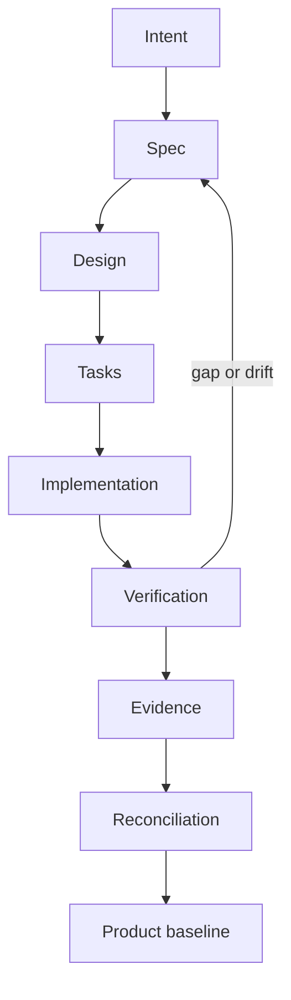
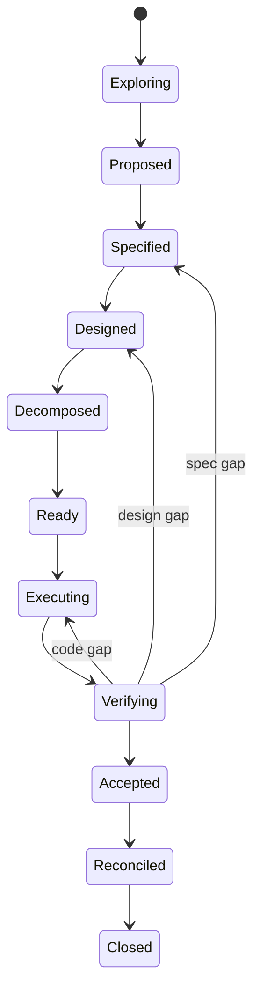

# Native SDD Core — каноническая модель SDD Dark Factory

- **Статус**: действует (принята [ADR-020](adr/ADR-020-native-sdd-core.md), 2026-09-14)
- **Автор**: software-architect; текст видения согласован пользователем
- **Заменяет**: модель ADR-017 (единый OpenSpec); ADR-017 сохраняется как историческое решение
- **Роль Spec Kit и OpenSpec**: bootstrap- и compatibility-инструменты; архитектуру SDD Dark Factory не определяют

Dark Factory использует **Native SDD Core** — собственную типизированную систему управления изменениями. Каждая разработка представлена ChangeSet со стабильным ID и структурой `Intent → Spec → Design → Tasks → Verification → Evidence → Reconciliation`. ChangeSet содержит дельту относительно канонического Product Baseline. Baseline принадлежит продукту и хранится рядом с кодом либо в отдельном product-spec репозитории для multi-repo продукта. Центральный OKF агрегирует продуктовые baselines, но не заменяет их как source of truth.

## 1. Архитектурное решение

Native SDD Core объединяет:

* governance, clarification, analysis, checklists и convergence из Spec Kit;
* ChangeSet, delta specifications и baseline reconciliation из OpenSpec;
* OKF как формат представления связанных знаний;
* собственные lifecycle, gates, evidence, WorkGraph и multi-repo orchestration.

Spec Kit и OpenSpec не становятся runtime-зависимостями. Они используются:

* для bootstrap-разработки Dark Factory;
* как источники практик;
* через import/export adapters.

> SDD в Dark Factory — типизированная система управления изменениями, связывающая Intent, Spec, Design, Tasks, Code, Verification, Evidence и актуальный Product Baseline.

## 2. Основная цепочка SDD



Артефакты отвечают на разные вопросы:

| Артефакт       | Вопрос                             |
| -------------- | ---------------------------------- |
| Intent         | Зачем необходимо изменение?        |
| Spec           | Что должно измениться?             |
| Design         | Как должно быть устроено решение?  |
| Tasks          | Какие работы необходимо выполнить? |
| Verification   | Как проверить результат?           |
| Evidence       | Чем подтверждено соответствие?     |
| Reconciliation | Как изменить актуальный baseline?  |

`Design` не является task plan. Архитектурное проектирование завершается до формирования `Tasks`.

## 3. Размещение baseline

Канонический baseline не обязан находиться в одном центральном репозитории.

### Один продукт — один репозиторий

```text
product-repo/
├── src/
├── tests/
└── .factory/
    ├── product/
    └── changes/
```

Baseline располагается рядом с кодом.

### Один продукт — несколько репозиториев

```text
small-ecom-spec/
small-ecom-backend/
small-ecom-web/
small-ecom-mobile/
small-ecom-gitops/
```

Канонический baseline и координирующие ChangeSet располагаются в `small-ecom-spec`.

### Уровень организации

Центральный OKF-контур:

* индексирует product baselines;
* связывает продукты, capabilities, API и события;
* формирует enterprise knowledge graph;
* обеспечивает поиск и context retrieval;
* является производной федеративной read-моделью.

Он не должен становиться центральным bottleneck для всех продуктовых изменений.

```text
Product repositories = canonical knowledge
Central OKF graph     = federated projection
```

## 4. Структура Product Baseline

```text
.factory/
├── factory.yaml
│
├── product/
│   ├── product.md
│   ├── capabilities/
│   ├── requirements/
│   ├── scenarios/
│   ├── architecture/
│   ├── decisions/
│   ├── contracts/
│   ├── data/
│   ├── ui/
│   └── deployment/
│
└── changes/
```

Baseline содержит только принятое состояние:

* `active`;
* `superseded`;
* `retired`.

Draft и proposed-артефакты существуют внутри ChangeSet и попадают в baseline только после acceptance и reconciliation.

## 5. Каноническая структура ChangeSet

```text
.factory/
└── changes/
    └── 2026/
        └── CHG-0142-reservation-timeout/
            ├── change.yaml
            ├── intent.md
            │
            ├── spec/
            │   ├── delta.yaml
            │   ├── requirements/
            │   ├── scenarios/
            │   ├── acceptance/
            │   └── constraints/
            │
            ├── design/
            │   ├── overview.md
            │   ├── architecture/
            │   ├── decisions/
            │   ├── data/
            │   ├── ui/
            │   └── deployment/
            │
            ├── contracts/
            │   ├── openapi/
            │   ├── asyncapi/
            │   └── schemas/
            │
            ├── tasks/
            │   ├── graph.yaml
            │   └── tasks.md
            │
            ├── verification/
            │   ├── plan.yaml
            │   └── acceptance.md
            │
            ├── evidence/
            │   └── index.yaml
            │
            ├── gates/
            │   ├── specification.yaml
            │   ├── design.yaml
            │   ├── implementation.yaml
            │   └── release.yaml
            │
            └── reconciliation/
                ├── plan.yaml
                └── result.yaml
```

Пустые каталоги не создаются. Набор артефактов определяется workflow profile и risk class.

Каталог ChangeSet не перемещается между `active` и `archive`. Его путь остаётся стабильным, а состояние хранится в `change.yaml`.

## 6. `change.yaml`

`change.yaml` — манифест и точка входа в ChangeSet:

```yaml
schema: dark-factory.dev/change/v1

id: chg:small-ecom:2026:0142
title: Изменение времени жизни резерва
slug: reservation-timeout

product: small-ecom
kind: product-feature
risk_class: R1
status: designed

baseline:
  revision: 8f3a2c1

workflow:
  profile: product-feature
  version: "1.0"

owners:
  product: team-ecom
  technical: team-inventory

targets:
  - repository: small-ecom-backend
    role: implementation
  - repository: small-ecom-web
    role: consumer
  - repository: small-ecom-gitops
    role: deployment

artifacts:
  intent: intent.md
  spec: spec/delta.yaml
  design: design/overview.md
  tasks: tasks/graph.yaml
  verification: verification/plan.yaml
  evidence: evidence/index.yaml
  reconciliation: reconciliation/plan.yaml
```

В Git хранится семантическое состояние:

```text
draft → proposed → specified → designed
→ ready → accepted → reconciled → closed
```

Текущая job, lease, retry, stage attempt и техническая ошибка хранятся в PostgreSQL.

## 7. Политика YAML frontmatter

### Где frontmatter обязателен

Он нужен у Markdown-файла, если файл:

* имеет собственный ID;
* является узлом OKF-графа;
* имеет lifecycle;
* участвует в traceability;
* может независимо переиспользоваться;
* имеет владельца или provenance;
* адресуется из другого артефакта.

Примеры:

* requirement;
* scenario;
* constraint;
* ADR;
* architecture view;
* UI screen;
* business rule;
* policy;
* capability;
* product;
* acceptance criterion, если он отдельный узел.

### Где frontmatter необязателен

Он не нужен для:

* обычного `README.md`;
* сгенерированного `tasks.md`;
* автоматически собранного `spec.md`;
* локального поясняющего текста;
* шаблонной инструкции;
* вложенного scenario внутри requirement;
* отчёта, метаданные которого уже находятся в `evidence/index.yaml`.

Таким образом, правило звучит не «все Markdown имеют frontmatter», а:

> Все самостоятельно адресуемые SDD-артефакты имеют YAML frontmatter. Generated views и вспомогательная документация могут его не иметь.

## 8. Минимальный frontmatter

Не следует перегружать каждый файл десятками полей.

```yaml
---
schema: dark-factory.dev/requirement/v1
id: req:small-ecom:reservation:timeout
type: requirement
title: Reservation timeout
product: small-ecom
status: proposed
change: chg:small-ecom:2026:0142
---
```

Остальные поля добавляются только при необходимости:

```yaml
owner: team-inventory
risk: medium
priority: must

supersedes:
  - req:small-ecom:reservation:timeout:v2

relations:
  realized_by:
    - design:small-ecom:reservation-expiration
  verified_by:
    - test:small-ecom:reservation-expiration
```

Git уже хранит автора, дату и историю изменения, поэтому не нужно автоматически обновлять `updated_at` в каждом файле и создавать лишний diff.

## 9. Spec

`spec/` содержит дельту ожидаемого поведения:

```text
spec/
├── delta.yaml
├── requirements/
├── scenarios/
├── acceptance/
└── constraints/
```

`delta.yaml` описывает операции над baseline:

```yaml
baseline_revision: 8f3a2c1

operations:
  - operation: modify
    target: req:small-ecom:reservation:timeout
    artifact: requirements/REQ-001-timeout.md

  - operation: add
    target: req:small-ecom:reservation:expiration-notification
    artifact: requirements/REQ-002-notification.md

  - operation: supersede
    target: req:small-ecom:reservation:legacy-timeout
    superseded_by: req:small-ecom:reservation:timeout
```

ChangeSet не копирует всю спецификацию продукта.

## 10. Design

`design/` описывает целевое решение:

* architecture impact;
* компоненты;
* интеграции;
* данные;
* UI;
* security;
* observability;
* deployment;
* rollout и rollback;
* ADR impact.

Каждый крупный design-артефакт может быть самостоятельным OKF-узлом:

```yaml
---
schema: dark-factory.dev/design/v1
id: design:small-ecom:reservation-expiration
type: design
title: Reservation expiration design
status: proposed
change: chg:small-ecom:2026:0142
realizes:
  - req:small-ecom:reservation:timeout
---
```

## 11. Tasks

Канонической декомпозицией является `tasks/graph.yaml`:

```yaml
schema: dark-factory.dev/task-graph/v1

tasks:
  - id: TASK-001
    title: Добавить конфигурацию timeout
    repository: small-ecom-backend
    type: implementation
    satisfies:
      - req:small-ecom:reservation:timeout
    depends_on: []

  - id: TASK-002
    title: Публиковать ReservationExpired
    repository: small-ecom-backend
    satisfies:
      - req:small-ecom:reservation:expiration-notification
    depends_on:
      - TASK-001
```

`tasks.md` генерируется из графа для человека. Plane является внешним рабочим представлением TaskGraph.

`plan.md` как архитектурный артефакт не используется. Если нужен implementation plan, он является представлением `tasks/graph.yaml`.

## 12. Verification, evidence и gates

### Verification

Определяет проверки до начала реализации:

```yaml
requirements:
  - requirement: req:small-ecom:reservation:timeout
    checks:
      - type: unit-test
      - type: integration-test
      - type: acceptance-scenario
```

### Evidence

В Git хранятся ссылки, digest и provenance:

```yaml
evidence:
  - id: EVD-001
    type: test-report
    verifies:
      - req:small-ecom:reservation:timeout
    uri: s3://factory-evidence/CHG-0142/report.xml
    digest: sha256:abc123
    result: passed
```

Тяжёлые отчёты и логи размещаются в CI artifacts или Object Storage.

### Gates

GateDecision содержит:

* policy и её версию;
* проверенную revision ChangeSet;
* результат;
* evidence;
* объяснение;
* агента или человека;
* override, если он разрешён.

## 13. Lifecycle



Не каждый профиль проходит все стадии:

| Профиль               | Flow                                                 |
| --------------------- | ---------------------------------------------------- |
| `bugfix-r0`           | reproduce → patch → verify                           |
| `product-feature`     | specify → design → tasks → implement → verify        |
| `ui-research`         | intent → explore → prototype → review                |
| `architecture-change` | impact → design → ADR → approval                     |
| `repository-rebuild`  | discovery → target design → migration waves → verify |
| `platform-change`     | design → IaC → security → deploy                     |

## 14. Reconciliation с baseline

После acceptance Dark Factory:

1. проверяет исходную baseline revision;
2. обнаруживает параллельные изменения;
3. повторно выполняет consistency analysis;
4. применяет `add/modify/supersede/retire`;
5. обновляет связи графа;
6. переводит принятые знания в `active`;
7. фиксирует новую baseline revision;
8. сохраняет результат в `reconciliation/result.yaml`;
9. обновляет центральную OKF-проекцию.

Отдельный актуальный baseline в формате OpenSpec не поддерживается.

## 15. Источники истины

| Система                 | Ответственность                        |
| ----------------------- | -------------------------------------- |
| Product repository      | Канонический baseline одного продукта  |
| Product-spec repository | Baseline multi-repo продукта           |
| Git                     | Версии SDD-артефактов и аудит          |
| PostgreSQL              | Runtime state, leases, retries, outbox |
| Plane                   | Представление и управление задачами    |
| GitLab/GitHub           | Код, MR/PR и CI                        |
| Object Storage          | Тяжёлые evidence                       |
| Central OKF             | Федеративный knowledge graph           |
| Dark Factory Console    | Единый пользовательский интерфейс      |

## 16. Связанные документы

- Решение о принятии модели — [ADR-020](adr/ADR-020-native-sdd-core.md)
- Сводная архитектура — [hld.md](hld.md) (§12)
- Исторические решения — [ADR-001](adr/ADR-001-adopt-spec-kit.md) (Spec Kit bootstrap), [ADR-017](adr/ADR-017-unified-openspec-sdd-factory-profile.md) (единый OpenSpec, заменён)
