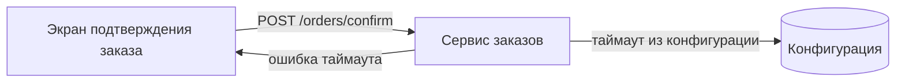

## Обзор

Пример (иллюстративный): таймаут оформления заказа задаётся конфигурацией сервиса
заказов и применяется на шаге подтверждения. При превышении таймаута сервис
прерывает оформление и возвращает клиенту явную ошибку, которую показывает экран
подтверждения заказа.

## Компоненты

- **Сервис заказов** — читает длительность таймаута из конфигурации и прерывает
  оформление по его истечении.
- **Конфигурация** — источник значения таймаута; меняется без изменения кода.
- **Экран подтверждения заказа** — показывает состояние ошибки таймаута
  (см. `design/ui/screens/SCR-001-example.md`).

## Решения

- [ADR-001 — Таймаут оформления из конфигурации](decisions/ADR-001-example.md)
