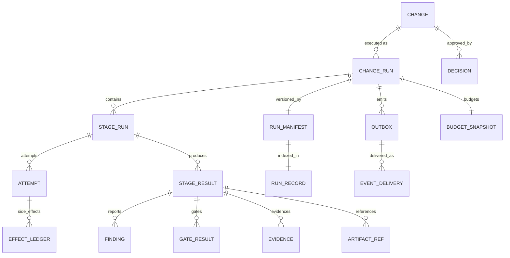

# Data Model: Dark Factory MVP (Phase 1)

**Feature**: `001-dark-factory-mvp` | **Date**: 2026-09-13 | **Plan**: [`plan.md`](./plan.md) | **Spec**: [`spec.md`](./spec.md)

Два слоя модели:

1. **Доменные контракты** (Python/Pydantic v2, версионируемые wire-типы) — реализованы в T-003, пакет `src/dark_factory/changes/`. Это transport/recovery-формат между CI jobs и форма run record.
2. **Операционное состояние** (PostgreSQL, ADR-004/006/016) — схема и миграции, T-006. Это authoritative state, а не wire-контракт.

Правило разделения (ADR-006 §2): Git — долгоживущая истина, PostgreSQL — authoritative operational state, CI — durable substrate, CI artifacts — тяжёлая evidence.

---

## 1. Доменные сущности (Key Entities спецификации)

Соответствие сущностей spec.md и реализованных контрактов T-003:

| Сущность spec.md | Контракт | Файл |
|---|---|---|
| Change | `Change` | `changes/run.py` |
| TaskSnapshot | `TaskEnvelope` входная часть (задача) | T-011 (`agents`) |
| RunSnapshot | `RunManifest` | `changes/run_records.py` |
| StageResult | `StageResult` (immutable) | `changes/run.py` |
| TaskEnvelope / AgentResult | контракт задания/результата агента | T-011 (`agents`) |
| AgentProfile | ролевой профиль | T-011 (`agents`) |
| FlowProfile | определение Flow | T-004 (`flows`) |
| Finding | `Finding` | `changes/findings.py` |
| Approval | `Decision` | `changes/findings.py` |
| ArtifactRef | `ArtifactRef` | `changes/refs.py` |
| ContextBundle | пакет контекста | T-012 (`context`) |
| RunRecord | `RunRecord` | `changes/run_records.py` |
| — (служебные) | `ChangeRun`, `StageRun`, `Evidence`, `GateResult`, `Usage`, `BudgetSnapshot` | T-003 |

### 1.1. Change

Единица работы, проходящая фабрику.

| Поле | Тип | Правила |
|---|---|---|
| `id` | `str` | непустой; идентификатор изменения |
| `title` | `str` | непустой |
| `description` | `str \| None` | — |
| `source` | `ChangeSource` | `tracker \| console \| cli \| api` |
| `external_ref` | `str \| None` | ссылка на задачу трекера; используется для дедупликации intake (FR-017) |
| `product` | `RepositoryRef` | провайдер + slug |
| `risk_class` | `RiskClass` | `R0…R4`; LLM может повысить, понизить — только политика (ADR-011 §5) |
| `change_request` | `ChangeRequestRef \| None` | единая модель PR/MR (ADR-019 §2) |
| `created_at` | `datetime` (UTC) | default now |

### 1.2. ChangeRun / StageRun (операционное состояние в контракте)

`ChangeRun` — один прогон изменения; `provider` фиксируется на старте run и **никогда не меняется** (инвариант эксклюзивности ADR-019 §5).

| `ChangeRun` | Тип | Правила |
|---|---|---|
| `id` | `str` | непустой |
| `change_id` | `str` | непустой |
| `route` | `Route` | `quick \| standard` |
| `provider` | `Provider` | `github \| gitlab`; immutable в рамках run |
| `status` | `RunStatus` | см. переходы 2.1 |
| `state_revision` | `int ≥ 1` | optimistic concurrency (ADR-006 §4) |
| `stages` | `list[StageRun]` | — |
| `budget` | `BudgetSnapshot` | сохраняется между запусками (FR-016) |
| `created_at` / `updated_at` / `finished_at` | `datetime` | `finished_at` — при терминальном статусе |

`StageRun`: `id`, `stage` (`Stage`), `status` (`StageStatus`), `attempt_number ≥ 1`, `input_revision`, `state_revision`, `started_at`, `finished_at`.

Правило переходов: единственная точка — `apply_status(target)`; переход вне таблицы → `InvalidStatusTransition`. Повтор стадии после `failed` — новый attempt той же логической операции; новая входная ревизия (например, после rework) — новый `StageRun` (ADR-006 §3).

### 1.3. StageResult (immutable артефакт)

`model_config = ConfigDict(frozen=True)`. Переносится между CI jobs.

| Поле | Тип | Правила |
|---|---|---|
| `schema_version` | `Literal[1]` | версия контракта (ADR-015 §3) |
| `stage` | `Stage` | — |
| `run_id`, `change_id` | `str` | непустые |
| `attempt_number` | `int ≥ 1` | — |
| `input_revision` | `str \| None` | — |
| `status` | `StageStatus` | только `waiting \| succeeded \| failed \| blocked` (валидатор) |
| `next_action` | `NextAction` | закрытое объединение (1.4) |
| `artifacts` | `list[ArtifactRef]` | — |
| `evidence` | `list[Evidence]` | — |
| `gate_results` | `list[GateResult]` | гейты против итогового SHA |
| `findings` | `list[Finding]` | — |
| `usage` | `Usage \| None` | — |
| `produced_at` | `datetime` (UTC) | — |

### 1.4. NextAction — закрытое дискончированное объединение

Дискриминатор `type`; ровно 8 вариантов (ADR-005 §2). Обработчики Flow обязаны покрыть все и завершиться `assert_never`.

| Вариант | Ключевые поля | Смысл |
|---|---|---|
| `execute_stage` | `next_stage`, `reason?` | продолжить маршрут |
| `wait_for_input` | `reason` | внешнее ожидание человека; результат сохранён до ожидания (ADR-006 §8) |
| `wait_for_ci` | `reason`, `change_request?` | ожидание пайплайна против CR |
| `rework` | `round ≥ 1`, `max_rounds ≥ 1`, `reason` | раунд доработки в лимите |
| `request_approval` | `gate`, `requested_from?`, `reason?` | human-гейт (ADR-018) |
| `merge` | `change_request`, `reason?` | merge по политике (ADR-011) |
| `release` | `target_environment` (default `dev`), `reason?` | релиз |
| `stop` | `outcome` (`blocked \| failed \| canceled`), `reason` | терминальная остановка |

### 1.5. Finding / GateResult / Decision

`Finding`: `id`, `origin` (`agent \| human \| ci`), `role?`, `severity` (`blocker \| major \| minor \| info`), `category?`, `file?`, `line?`, `reviewed_sha?`, `required_action?`, `status` (`open \| resolved \| waived \| obsolete`), `confidence?` (0.0–1.0, самооценка уверенности источника; не влияет на блокирующий вес — его задаёт severity+status, T-013), `evidence_ids`.
Человеческие замечания MR входят как данные (`origin=human`, severity `info`), не влияют на права/гейты (FR-007): блокирует только явное решение человека в flow approvals (ADR-018).

`GateResult`: `gate` (7 гейтов MVP), `status` (`pending \| passed \| failed \| skipped`), `sha?`, `summary?`, `evidence_ids`. Гейт оценивается против итогового SHA.

`Decision` (approval): `id`, `gate`, `outcome` (`approved \| rejected \| waived`), `decided_by` (`human \| policy \| agent`), `role?`, `decided_at`, `comment?`, `evidence_ids`. Version-bound: смена hash/SHA аннулирует approval (ADR-009 §7).

### 1.6. ArtifactRef / Evidence

`ArtifactRef`: `artifact_type`, `uri`, `revision?`, `sha256?`, `producer?`.
`Evidence`: `id`, `type` (`log \| report \| screenshot \| sbom \| spec \| diff \| test_results \| deployment \| smoke \| other`), `uri`, `checksum?`, `produced_at?`, `required`, `available`. Поля `required`/`available` питают инвариант завершения (1.8).

### 1.7. Usage / BudgetSnapshot

`Usage`: `prompt_tokens`, `completion_tokens`, `total_tokens?`, `cost?` (`Decimal`).
`BudgetSnapshot`: `max_rework_rounds` (default 3), `used_rework_rounds`, `token_budget?`, `tokens_used`, `cost_budget?`, `cost_used`, `deadline?`; свойства `rework_rounds_remaining`, `rework_exhausted`, `token_budget_exhausted`, `cost_budget_exhausted`. Неизвестный расход трактуется консервативно (FR-018) — поэтому поля не валидируются против бюджетов в модели.

### 1.8. RunManifest / RunRecord и инвариант завершения

`RunManifest` — протокол версионирования (ADR-015 §5): `factory_version`, `factory_commit`, `pack_name?`, `pack_version?`, `blueprint_version?`, `product_commit`, `gitops_commit?`, `okf_revision?`. Связи — immutable refs, не `latest`.

`RunRecord` = `schema_version` + `manifest` + `change` + `run` + `stage_results` + `decisions`.

`completion_violations(run, stage_results)` (ADR-009 §9) — успешный терминальный статус запрещён, если:
- обязательная evidence недоступна (`required and not available`), → `evidence_unavailable`;
- остаётся открытый blocker-finding.

Для не-successful run проверки не применяются.

### 1.9. Ключи идемпотентности (ADR-006 §3)

```text
operation_key = execution_id + stage_id + input_revision
attempt_id    = operation_key + attempt_number
effect_key    = operation_key + effect_type + effect_target
```

`operation_key` одинаков для всех повторов стадии; `attempt_id` не входит в ключ операции; `effect_key` уникален в effect ledger.

---

## 2. Переходы состояний

### 2.1. RunStatus (`RUN_STATUS_TRANSITIONS`)

```text
pending   → running | canceled | superseded
running   → waiting | blocked | succeeded | failed | canceled | superseded
waiting   → running | blocked | failed | canceled | superseded
blocked   → running | failed | canceled | superseded
succeeded | failed | canceled | superseded → ∅ (terminal)
```

### 2.2. StageStatus (`STAGE_STATUS_TRANSITIONS`)

```text
pending     → in_progress | skipped | canceled | superseded
in_progress → waiting | succeeded | failed | blocked | canceled | superseded
waiting     → in_progress | failed | blocked | canceled | superseded
blocked     → in_progress | failed | canceled | superseded
failed      → in_progress | canceled | superseded   # retry = новый attempt
succeeded | skipped | superseded | canceled → ∅ (terminal)
```

Особенности: `failed` стадии **не терминален** — retry той же логической операции; `succeeded` финален, новая ревизия входа ⇒ новый `StageRun`.

### 2.3. Гейты MVP

`Gate`: `specification`, `planning`, `code`, `ui`, `review`, `verification`, `release`. Статусы — `GateStatus`. Human-гейты и режимы участия — по фазам (ADR-018, HLD §8.3).

---

## 3. Операционное состояние PostgreSQL (T-006)

Источник — ADR-004 (состав), ADR-006 §3/§6 (lease/fencing, effect ledger), ADR-016 §3/§5 (outbox/event_delivery).

### 3.1. Execution / stage / attempt

- `execution` — логическая операция изменения: `id`, `change_id`, `route`, `provider` (immutable), `status`, `state_revision`, timestamps.
- `stage` — стадия внутри execution: `id`, `execution_id`, `stage`, `status`, `input_revision`, `state_revision`, timestamps.
- `attempt` — физическая попытка: `id` (`attempt_id`), `operation_key`, `stage_id`, `attempt_number`, `status`, timestamps. Уникальность `operation_key` гарантирует единственную логическую операцию на (execution, stage, input_revision).

Все изменения execution выполняются с проверкой `state_revision` **и** `fencing_token` (ADR-006 §6).

### 3.2. Execution leases

`execution_leases`: `resource_type`, `resource_id`, `owner_id` (= pod UID), `fencing_token` (монотонный), `acquired_at`, `expires_at`, `heartbeat_at`. Инварианты: монотонность `fencing_token`; lease `global-reconciler`. Kubernetes `Forbid` — оптимизация, корректность — за БД.

### 3.3. Effect ledger

Durable учёт внешних side effects (branch, commit, MR, deployment, comment): `effect_key` (уникален), `status` (`planned \| in_progress \| succeeded \| unknown`), `external_ref`, timestamps. При `unknown` — lookup по детерминированному маркеру **до** повтора. Crash-тесты: `crash-before-call` и `crash-after-call-before-commit` не создают второй идентичный внешний эффект.

### 3.4. Outbox / event_delivery (ADR-016)

`outbox` — версионированный envelope: `eventId`, `eventType`, `eventVersion`, `occurredAt`, `changeId`, `runId`, `stage`, `aggregateId`, `aggregateVersion`, `correlationId`, `causationId`, `artifactRefs`, `payload`, `sequence`.
`event_delivery` — per-consumer доставка: `event_id`, `consumer_id`, `status`, `attempts`, `next_attempt_at`, `last_error`. Инвариант: уникальность пары (`event_id`, `consumer_id`); «изменение состояния + запись в outbox» — в одной транзакции.

### 3.5. Usage / cost

Агрегаты расхода на execution/attempt (для FR-018/FR-024 и SC-003): токены, стоимость (`Decimal`), число раундов, число ручных вмешательств.

---

## 4. Связи (er-диаграмма)



## 5. Правила валидации (сводно)

- Строковые идентификаторы — непустые; `attempt_number`, `round`, `line`, `state_revision` — положительные.
- `StageResult` frozen; `status` — только результат-статусы; переходы — через `apply_status` по таблице.
- `ChangeRun.provider` immutable в рамках run; смена провайдера репозитория применяется только к новым run (ADR-019 §5).
- Успешный терминальный статус запрещён при `required && !available` evidence или открытом blocker-finding.
- `effect_key` и `operation_key` уникальны; пара (`event_id`, `consumer_id`) уникальна.
- Human-текст (комментарии MR) — untrusted data: не влияет на права и гейты (FR-007) и не попадает в prompt без scan/redaction (ADR-009 §8).
